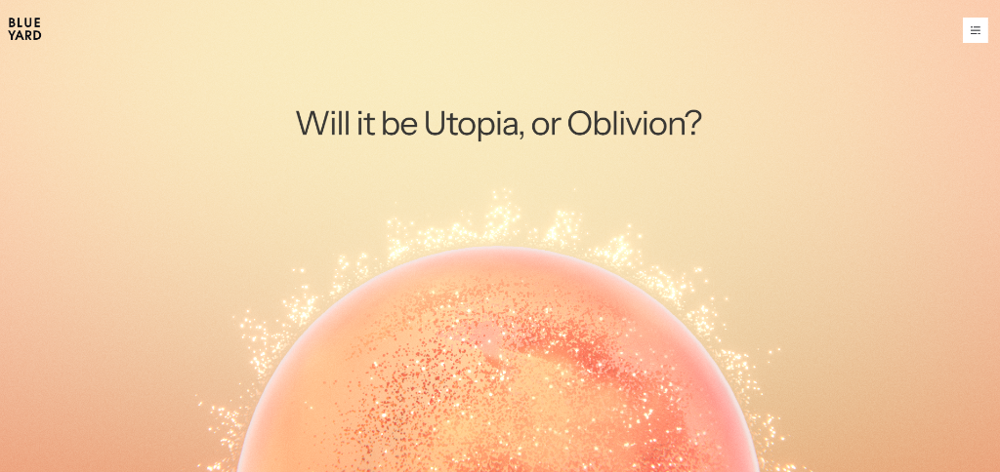
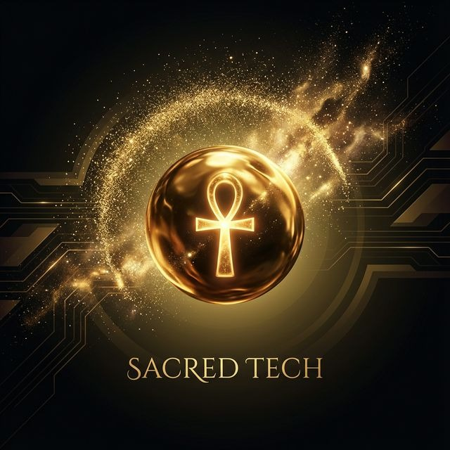
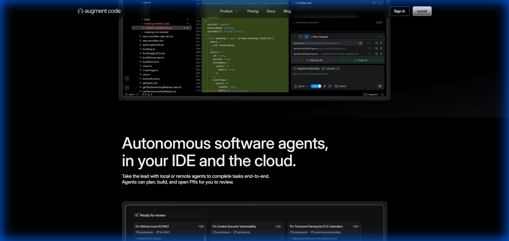
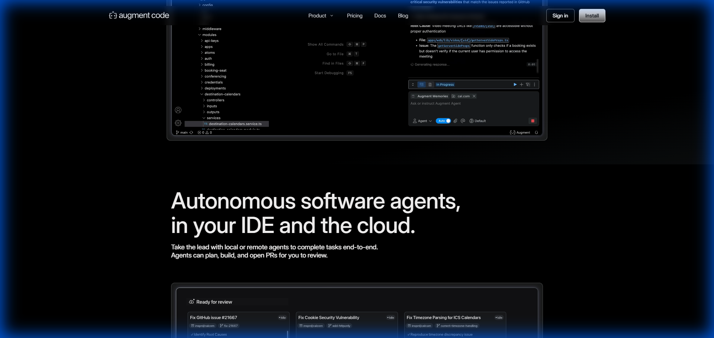
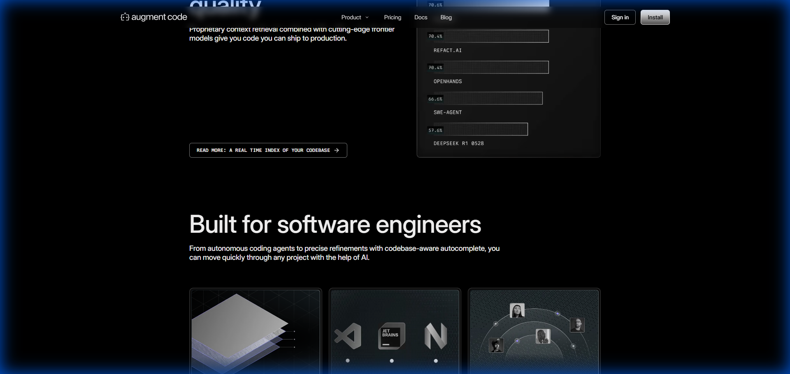

# TASK_2025_072 - Landing Page Rich Content Enhancement

**Created**: 2025-12-14  
**Status**: 📋 DESIGN COMPLETE  
**Related**: TASK_2025_038 (original landing page)

---

## Objective

Enhance the Ptah Extension landing page with rich content and nano banana design aesthetic inspired by BlueYard Capital, Augmentcode, and Antigravity.

---

## Section-to-Reference Mapping

| Section        | Reference Asset                                                  | Inspiration Source               |
| -------------- | ---------------------------------------------------------------- | -------------------------------- |
| **Hero**       | `reference_blueyard_hero.png` + `reference_sacred_tech_ankh.jpg` | BlueYard + Egyptian              |
| **Demo**       | `reference_augmentcode_demo.png`                                 | Augmentcode (code window chrome) |
| **Features**   | `reference_augmentcode_features.png` + `feature_card_mockup.png` | Augmentcode cards                |
| **Comparison** | `reference_antigravity_scroll.png`                               | Antigravity scroll reveal        |
| **CTA**        | `reference_augmentcode_cta.png`                                  | Augmentcode footer CTA           |

---

## Design References

### Hero - BlueYard + Sacred Tech

### Demo - Augmentcode Code Window

### Features - Augmentcode Cards

### CTA - Augmentcode Footer

---

## Three.js Implementation Notes

| Element          | Three.js Approach                                     |
| ---------------- | ----------------------------------------------------- |
| Golden sphere    | `MeshStandardMaterial` (metalness: 1, roughness: 0.2) |
| Ankh symbol      | Texture map or 3D geometry overlay                    |
| Particle halo    | `THREE.Points` with custom shader                     |
| Glow/bloom       | `EffectComposer` + `UnrealBloomPass`                  |
| Circuit patterns | CSS/SVG background (not Three.js)                     |

---

## Design Assets

| File                                 | Section    | Description              |
| ------------------------------------ | ---------- | ------------------------ |
| `feature_card_mockup.png`            | Features   | Glassmorphism card       |
| `hero_ankh_sphere.png`               | Hero       | Generated Ankh concept   |
| `hero_pyramid_scene.png`             | Hero       | Pyramid background       |
| `reference_blueyard_hero.png`        | Hero       | BlueYard inspiration     |
| `reference_sacred_tech_ankh.jpg`     | Hero       | Egyptian tech reference  |
| `reference_augmentcode_demo.png`     | Demo       | Code window chrome       |
| `reference_augmentcode_features.png` | Features   | Card layout              |
| `reference_augmentcode_cta.png`      | CTA        | Footer CTA design        |
| `reference_antigravity_scroll.png`   | Comparison | Scroll reveal            |
| `reference_augmentcode_hero.png`     | Hero       | Particle effect          |
| `circuit_pattern_background.png`     | Background | Egyptian circuit overlay |
| `circuit_corner_topleft.png`         | Background | Corner decoration (TL)   |
| `circuit_corner_bottomright.png`     | Background | Corner decoration (BR)   |

---

## Next Steps

1. Run `/phase-4-architecture TASK_2025_072` for implementation planning
2. Implement Three.js scene with Ankh sphere + particles
3. Apply GSAP animations to all sections
4. Style Demo section with Augmentcode window chrome
5. Create Features cards matching Augmentcode layout
