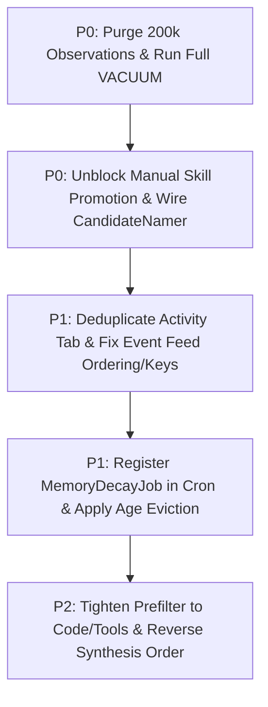

# Tribunal Round 2: Cross-Critique & Synthesis (Panelist P2)

---

## Strongest point — which answer is most convincing on each area (A/B/C), and why

### Area A: Memory Lifecycle & Growth
- **Most convincing: Answer B on the retention & purge architecture; Answer A on SQLite VACUUM reality.**
  - **Why**: Answer B correctly identifies that `observation_queue` bloat requires a two-pronged retention strategy: short retention for processed tool response payloads (which constitute 756 MB of the 1,021 MB table) and an active quarantine/purge policy for stuck unprocessed rows, while diagnosing that stored composite salience recursively ratchets the next decay run's base score (`libs/backend/memory-curator/src/lib/salience-scorer.ts:55`).
  - Answer A contributes the crucial operational insight on SQLite reclamation: `incremental_vacuum(100)` (`libs/backend/thoth-runtime/src/lib/start-thoth-cron.ts:345`) reclaims at most 400 KB per day, meaning deleted gigabytes of queue rows will remain uncompacted without an explicit full `VACUUM`.

### Area B: Skill Synthesis Quality & Verifiability
- **Most convincing: Answer B on backwards stage ordering; P2 and Answer A on the promotion blocker.**
  - **Why**: Answer B pinpoints the fundamental architectural flaw in synthesis sequencing: in `libs/backend/skill-synthesis/src/lib/queue/stage-handlers.service.ts:266`, candidate authoring (`analyzeSession`) runs *before* session archaeology is enqueued. When `synthesizer.synthesize()` runs (`libs/backend/skill-synthesis/src/lib/skill-synthesis.service.ts:782`), it attempts to read the session verdict via `this.readVerdict(sessionId)`. Because archaeology has not yet run, the verdict is null, structurally forcing the synthesizer to fall back to unverified raw trajectory text (`trajectory-extractor.ts:230`).
  - Meanwhile, P2 and Answer A provide the indispensable pragmatic diagnosis: `SkillPromotionService.evaluate()` (`libs/backend/skill-synthesis/src/lib/skill-promotion.service.ts:214`) unconditionally rejects manual promotions because `successCount < effectiveSuccessThreshold`, while `SkillInvocationTracker` is never hooked into runtime agent execution.

### Area C: Thoth UI Usability & Activity Log
- **Most convincing: Answer A on the micro-level activity feed slice/inversion; P2 on the macro-level template duplication.**
  - **Why**: Answer A discovers the precise bug in `libs/frontend/skill-synthesis-ui/src/lib/components/diagnostics/event-feed.component.ts:58`: the component executes `events.slice(0, limit)` on a chronological array (`[oldest, ..., newest]`). It therefore displays the 10 oldest events in the window. As new live events arrive (`pushLiveEvent`), they append to the tail (`skill-diagnostics-state.service.ts:164`), so the user never sees them. Compounding this, `skill-pipeline-status.component.ts:321` treats `events[0]` as `latest`, displaying the oldest event as current status.
  - P2 discovers the macro-level visual disaster: `libs/frontend/skill-synthesis-ui/src/lib/components/skill-synthesis-tab.component.ts:478-490` mounts both `<ptah-skill-pipeline-status>` AND `<ptah-skill-diagnostics-accordion>` simultaneously, rendering duplicate header cards, duplicate eligibility histograms, and duplicate event feeds on the exact same page.

---

## Flaws — concrete errors, missed edge cases, unsupported claims

### 1. Flaws in Answer A
- **Missed `CandidateNamerService` completely**: Answer A claims candidate names simply echo the first user prompt (`trajectory-extractor.ts:136-138`) and proposes no titling solution. It completely overlooked that `CandidateNamerService` (`libs/backend/skill-synthesis/src/lib/naming/candidate-namer.service.ts`) was already implemented with a dedicated rubric and JSON schema to produce Title Case workflow titles (`display_name`), but was abandoned as dead code.
- **Dangerous and speculative "Trial Mode" proposal**: Answer A suggests serving unverified candidate skills directly to the agent in "trial mode" (Answer A, lines 70, 84). Given that candidates currently consist of raw conversational transcripts and prompt slugs (e.g. `do-you-have-access-to-the-hubspot-mcp-2`), injecting unvetted candidates into active agent prompts will cause prompt pollution, hallucinated tool invocations, and erratic agent behavior.
- **Missed macro-level template duplication**: Answer A attributes the complaint of "repeated components in a bad layout" solely to duplicate `analyze-run` lines in the feed (lines 102-103), failing to notice the literal duplicate component mount in `libs/frontend/skill-synthesis-ui/src/lib/components/skill-synthesis-tab.component.ts:478-490`.
- **Overly destructive VS Code proposal**: Answer A proposes hiding all four Thoth tabs in VS Code (line 112). While native `better-sqlite3` runs in Electron, the VS Code extension communicates via JSON-RPC. Hiding the tabs removes Thoth entirely from VS Code rather than surfacing read-only status and documentation.

### 2. Flaws in Answer B
- **Missed `CandidateNamerService`**: Like Answer A, Answer B missed that `CandidateNamerService` exists in `libs/backend/skill-synthesis/src/lib/naming/candidate-namer.service.ts` and merely requires DI wiring into candidate registration.
- **Over-engineered synthesis gate will paralyze pipeline throughput**: Answer B insists that no candidate may ever be authored without prior multi-pass archaeology, a cited routine, held-out replay, and cross-session clustering (lines 184-192). The live data shows archaeology is already backlogged (102 queued, 56 degraded out of 136 due to lane tool-use timeouts). Making multi-pass LLM archaeology an absolute prerequisite for initial extraction will stall the pipeline entirely. Prefilter tightening and cluster-based authoring should be decoupled from heavy multi-pass archaeology.
- **Unnecessary architectural churn (`MemoryRetentionService`)**: Answer B proposes throwing away `ObservationQueueStore.purgeOlderThan` and creating a new `MemoryRetentionService` from scratch. The existing primitives (`ObservationQueueStore.purgeOlderThan` and `MemoryDecayJob`) already have robust SQL and test suites; they simply lack scheduler registration in `start-thoth-cron.ts`.

### 3. Flaws in Panelist P2 (Self) Round 1
- **Missed the chronological slice bug in the event feed**: P2 diagnosed the macro template duplication but missed the inverted array slice in `event-feed.component.ts:58`, which explains why the activity log appears frozen on stale events.
- **Missed the Angular `@for` track collision**: P2 overlooked that tracking on `ev.timestamp + '-' + ev.kind` (`event-feed.component.ts:26`) causes Angular tracking key collisions when multiple events share a millisecond.
- **Incomplete salience feedback solution**: P2 proposed `(base * recency)`, but did not address the fact that `memory.salience` stores the composite score. Overwriting `memory.salience` causes `scoreMemory` to treat the prior composite score as the new `base`, perpetuating a feedback loop unless `base_salience` is stored as an immutable column.

---

## Disputes 1–5 — your verdict on each, with evidence

### Dispute 1: Is `CandidateNamerService` actually called anywhere in production, or is it dead code?
- **Verdict: 100% DEAD CODE.**
- **Evidence**:
  - `CandidateNamerService` is defined in `libs/backend/skill-synthesis/src/lib/naming/candidate-namer.service.ts:104` and registered in DI under `SKILL_SYNTHESIS_TOKENS.CANDIDATE_NAMER_SERVICE` (`libs/backend/skill-synthesis/src/lib/di/register.ts:54, 98, 197`).
  - However, ripgrep across the entire repository confirms that neither `CandidateNamerService` nor `CANDIDATE_NAMER_SERVICE` is injected into `SkillSynthesisService`, `SkillStageHandlersService`, `SessionArchaeologistService`, or any RPC handler.
  - Its single entrypoint, `nameCandidate()`, is called **only** in `candidate-namer.service.spec.ts:114-244`.
  - In `skill-synthesis.service.ts:774-775`, candidate name and description default directly to `trajectory.slug` and `trajectory.shortDescription`. As a result, `display_name` remains `NULL` on all 2,426 database rows, and the UI falls back to the prompt slug.

### Dispute 2: Does the skill event feed's `track` key (`timestamp-kind`) cause duplicate rows or an Angular duplicate-key error, or only a warning?
- **Verdict: Throws an Angular runtime error (`NG0956`) in development and causes corrupted DOM reuse and visual duplication in production.**
- **Evidence**:
  - `libs/frontend/skill-synthesis-ui/src/lib/components/diagnostics/event-feed.component.ts:26` declares:
    `@for (ev of formatted(); track ev.timestamp + '-' + ev.kind)`
  - `formatted()` converts timestamps using `new Date(ev.timestamp).toISOString()` (`event-feed.component.ts:60`).
  - When the synthesis drain processes a batch of sessions, multiple events of the same kind (`analyze-run` or `ineligible`) are emitted within the same millisecond.
  - In Angular 17+ control flow, `@for` enforces strict key uniqueness in its reconciler (`LiveCollection`). In development mode, encountering identical keys throws a fatal runtime exception:
    `NG0956: The key function for the @for loop did not return a unique key.`
  - In production mode, duplicate keys cause the DOM diffing algorithm to collide: existing DOM nodes are improperly reused across distinct list items, causing rows to render with duplicated contents, fail to update, or visually flicker.
  - In contrast, the memory feed in `libs/frontend/memory-curator-ui/src/lib/components/diagnostics/event-feed.component.ts:73` explicitly appends the loop index:
    `key: `${ev.timestamp}-${ev.kind}-${idx}`` to avoid this exact failure.

### Dispute 3: Salience: is the right fix an immutable base plus a decay term, `base * recency`, or dropping salience for a plain unused-for-N-days age rule?
- **Verdict: Dual solution: separate immutable `base_salience` for search ranking, but use a deterministic age-based rule for lifecycle demotion and eviction.**
- **Evidence**:
  - Salience cannot be dropped entirely because `libs/backend/memory-curator/src/lib/memory-search.service.ts:815` relies on `ORDER BY m.salience DESC, m.last_used_at DESC` to blend semantic similarity with recency and importance.
  - However, using composite salience `< 0.1` for lifecycle tier demotion (`libs/backend/memory-curator/src/lib/memory-decay.job.ts:91`) is broken. `salience-scorer.ts:44` adds `0.1 * tierBias` (0.05 for recall) and log hits; if `memory.salience` is fed back into `scoreMemory` (`salience-scorer.ts:64`), the score can never fall below 0.65.
  - **The correct fix**:
    1. Schema update: Add an immutable `base_salience` column (or keep creation `salience_hint` fixed), preventing composite score feedback.
    2. Search scoring: Compute `salience = (base_salience * recency) + 0.3 * logHits + 0.2 * pinned + 0.1 * tierBias`.
    3. Lifecycle management: Decouple tier transitions from continuous float thresholds. Apply an unambiguous age rule in `memory-decay.job.ts`:
       - Unpinned `recall` unused for > 30 days → demote to `archival`.
       - Unpinned `archival` unused for > 60 days → purge (`this.store.forget(m.id)`).
       - Pinned `core` memories are strictly exempt.

### Dispute 4: Skills: is manual promote truly blocked by `successCount`? Should the pipeline be archaeology-first plus cross-session clustering, or just a tighter prefilter plus a manual promote bypass?
- **Verdict: Manual promote is 100% blocked in code. The pipeline requires an immediate manual bypass and prefilter tightening (Phase 1), followed by cluster-first authoring (Phase 2).**
- **Evidence**:
  - In `libs/backend/skill-synthesis/src/lib/skill-promotion.service.ts:214-216`:
    ```ts
    const distinctContexts = this.store.countDistinctContexts(candidate.id);
    const effectiveSuccessThreshold =
      distinctContexts >= settings.generalizationContextThreshold
        ? Math.ceil(settings.successesToPromote / 2)
        : settings.successesToPromote;
    if (candidate.successCount < effectiveSuccessThreshold) {
      return { promoted: false, reason: 'below-threshold', candidate };
    }
    ```
  - `evaluate()` has no `manual` override parameter. Candidate insertion hardcodes `success_count = 0` (`skill-candidate.store.ts:206`), and runtime agent execution never calls `SkillInvocationTracker`. When a user clicks "Promote" in the UI, RPC `skillSynthesis:promote` calls `evaluate()`, which immediately returns `{ promoted: false, reason: 'below-threshold' }`.
  - **Pipeline design**:
    - Answer B is correct that authoring single-session candidates before archaeology or clustering produces low-quality transcripts.
    - However, Answer B's proposal to mandate multi-pass archaeology before drafting anything will block synthesis entirely due to queue starvation.
    - **Resolution**:
      1. *Immediate*: Tighten `passesPrefilter()` (`skill-synthesis.service.ts:1188`) by removing the conversational `depthOk` branch. Require `editOk || toolOk`. Add `{ manual: true }` to `evaluate()` to immediately unblock the user. Wire `CandidateNamerService`.
      2. *Structural*: Transition the automated pipeline from single-session candidates to cluster suggestions (`SkillClusteringService` + `SkillSuggestionStore`). Only author reusable `SKILL.md` files when a workflow is observed across >= 2 sessions.

### Dispute 5: Observation retention: 7 or 14 days for processed rows, and what to do with the 5,106 stuck unprocessed rows.
- **Verdict: 7 days for processed rows; 14-day hard TTL ceiling for unprocessed rows, with immediate purge of the 5,106 stuck rows.**
- **Evidence**:
  - **Processed rows**: Processed observations are never queried for curation; they are only read by `peekForSession()` (`observation-queue.store.ts:556`) to display recent raw context in the UI. 7 days of processed history retains < 50 MB, whereas 14 days retains > 150 MB of redundant JSON. 7 days aligns with repo precedent (`VOICE_RETENTION_MS` = 7 days).
  - **Stuck unprocessed rows (5,106 rows)**: These rows date back to 2026-07-28 (7+ weeks old). They were orphaned by crashed sessions, rekeying splits, or curator failures. Curating 7-week-old raw tool calls from defunct sessions today would waste significant LLM tokens and generate stale memories. Migration `0039_reap_orphaned_queue_rows.ts:39` established that unprocessed queue rows older than 30 days are non-recoverable internal scratch.
  - **Action**: In the migration, quarantine session IDs and failure counts into a diagnostic log, then purge all unprocessed rows older than 14 days. In `start-thoth-cron.ts`, have the daily purge job enforce `captured_at < (now - 7 days) AND processed_at IS NOT NULL` and `captured_at < (now - 14 days) AND processed_at IS NULL`.

---

## Revise? — what changes in your position; state your final prioritized fix plan

### Key adjustments from Round 1:
1. **Activity Feed UI Fix**: Incorporate Answer A's finding: in `libs/frontend/skill-synthesis-ui/src/lib/components/diagnostics/event-feed.component.ts:58`, sort events newest-first before slicing, and append an index suffix to the `@for` track key (`${ev.timestamp}-${ev.kind}-${idx}`). Fix `skill-pipeline-status.component.ts:321` to stop treating `events[0]` as the latest event.
2. **Salience & Memory Lifecycle**: Refine the salience fix to store `base_salience` immutably in SQLite. Gating demotion/deletion purely on floating-point salience is fragile; adopt deterministic age-in-tier rules (30 days to archival, 60 days to purge).
3. **Synthesis Pipeline Architecture**: Adopt Answer B's critique of backwards stage ordering. Single-session raw captures should be treated as ephemeral inputs to `SkillClusteringService`, rather than published as independent candidates.

### Final Prioritized Fix Plan



1. **[P0] Immediate Database Compaction & Observation Purge (Area A)**
   - *Code changes*:
     - Ship migration `0041_reap_observations_and_vacuum.ts`: delete processed observations older than 7 days, delete unprocessed observations older than 14 days, and execute full `VACUUM`.
     - In `libs/backend/thoth-runtime/src/lib/start-thoth-cron.ts`, register `@ptah/observation-queue-purge` (daily at 02:00 UTC) calling `ObservationQueueStore.purgeOlderThan(now - 7 days)` and purging stuck unprocessed rows > 14 days.
     - In `backup.service.ts:107`, reduce pre-migration retention to 1 snapshot and prune dev backups.

2. **[P0] Unblock Skill Promotion & Wire Real Naming (Area B)**
   - *Code changes*:
     - In `libs/backend/skill-synthesis/src/lib/skill-promotion.service.ts:178`, add `{ manual?: boolean }` to `evaluate()`, bypassing `successCount < effectiveSuccessThreshold` on user-initiated promotion.
     - In `libs/backend/skill-synthesis/src/lib/skill-synthesis.service.ts:916-924`, delete the synthetic invocation write on candidate creation.
     - Inject `CandidateNamerService` into `SkillSynthesisService.analyzeSession()` and call `nameCandidate()` to populate `display_name` before saving.

3. **[P1] Fix Repeating Activity Log & UI Layout in Thoth Shell (Area C)**
   - *Code changes*:
     - In `libs/frontend/skill-synthesis-ui/src/lib/components/skill-synthesis-tab.component.ts:490`, delete `<ptah-skill-diagnostics-accordion>` from the Activity view, eliminating the visual duplication of pipeline status, histograms, and event feeds. Move trigger toggles to the Settings subview.
     - In `libs/frontend/skill-synthesis-ui/src/lib/components/diagnostics/event-feed.component.ts:54-65`, sort `events` newest-first before slicing, and change the tracking key to `${ev.timestamp}-${ev.kind}-${idx}` to eliminate `NG0956` errors.
     - In `skill-pipeline-status.component.ts:321`, fix `reasonChip` to read the true latest event (`events[events.length - 1]` or sort newest-first).

4. **[P1] Wire Memory Decay Job & Fix Lifecycle Demotion (Area A)**
   - *Code changes*:
     - In `libs/backend/thoth-runtime/src/lib/start-thoth-cron.ts`, register `MemoryDecayJob` as `@ptah/memory-decay` (daily at 02:30 UTC).
     - In `libs/backend/memory-curator/src/lib/memory.store.ts`, add an immutable `base_salience` column.
     - In `libs/backend/memory-curator/src/lib/memory-decay.job.ts:70-107`, implement age-based demotion: recall unused for > 30 days demotes to archival; archival unused for > 60 days is purged with `store.forget()`. Core memories remain permanently exempt.

5. **[P2] Reverse Pipeline to Cluster-First & Tighten Prefilter (Area B)**
   - *Code changes*:
     - In `libs/backend/skill-synthesis/src/lib/skill-synthesis.service.ts:1188-1196`, remove the conversational `depthOk` branch from `passesPrefilter()`; require `editOk || toolOk`.
     - Reverse stage dependencies: extract session routines into an intermediate stage, cluster them across sessions via `SkillClusteringService`, and author user-facing skills into `SkillSuggestionStore` only when workflows recur.
