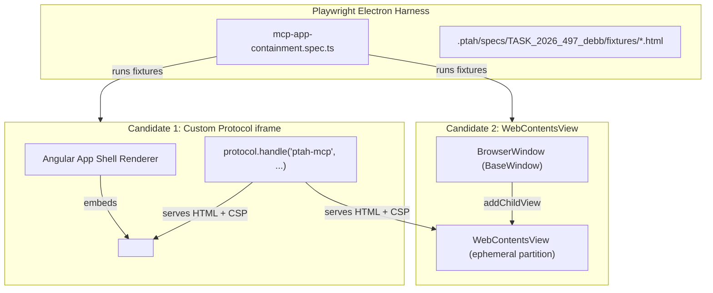

# MCP App HTML Containment in Electron: Architecture Comparison & Spike Preparation

> **TASK_2026_497_debb Spike Preparation**  
> **Status**: Backlog / Prepared (Pre-Spike Complete)  
> **Target Branch**: `lane-b/task-496-497-spikes`  
> **Parent Research**: [TASK_2026_490_583c/research-report.md](.ptah/specs/TASK_2026_490_583c/research-report.md) (Revisions 4 & 6), [research-mcp-apps.md](.ptah/specs/TASK_2026_490_583c/research-mcp-apps.md)  
> **Dependencies**: Blocked on [TASK_2026_491_e0da](.ptah/specs/TASK_2026_491_e0da/task.md)

---

## 1. Scope Limitation & Dependency on TASK_2026_491_e0da

### Current Blockers
This task ([`TASK_2026_497_debb`](.ptah/specs/TASK_2026_497_debb/task.md)) evaluates the containment strategy for untrusted third-party Model Context Protocol (MCP) App HTML inside Ptah's Electron desktop application.

Full end-to-end execution of this spike is **strictly blocked on [TASK_2026_491_e0da](.ptah/specs/TASK_2026_491_e0da/task.md)**, which is concurrently implemented in an independent worktree:
1. **Defective Session Permission Handlers**: In [`apps/ptah-electron/src/windows/main-window.ts:136-143`](apps/ptah-electron/src/windows/main-window.ts#L136-L143), `setPermissionRequestHandler` and `setPermissionCheckHandler` validate requests solely via `contents.id === mainWindow.webContents.id`. Because child iframes share the top-level `webContents.id`, any subframe currently inherits full main-frame permissions. TASK_2026_491_e0da replaces this with an origin-aware, main-frame-aware policy where untrusted origins are categorically denied.
2. **Missing Shell Content-Security-Policy**: The Electron shell currently loads without an active runtime CSP ([`TASK_2026_491_e0da/context.md:12`](.ptah/specs/TASK_2026_491_e0da/context.md#L12)). Running an iframe spike before the shell has a restrictive CSP (specifically `frame-src` and `connect-src` restrictions) would produce invalid security baselines.

### Scope Delivered Here
Per explicit scope boundaries, this deliverable touches **no Electron product code** (preserving all code in `apps/` and `libs/`) and does not execute the live containment spike. Instead, this phase delivers:
1. The architectural comparison matrix between Custom-Protocol `iframe` and `WebContentsView`.
2. The technical justification for origin granularity (per-server, per-app, per-version).
3. The complete, executable attack fixture corpus under `.ptah/specs/TASK_2026_497_debb/fixtures/`.
4. The specification for the 7 Electron isolation controls that the spike must set and assert.
5. The test harness execution plan for the subsequent agent.

### Action Plan for the Subsequent Agent (Once 491 Lands)
Once `TASK_2026_491_e0da` merges into `origin/main` (or the integration branch):
1. **Rebase/Merge**: Update the worktree to include 491's origin-aware permission handlers and shell CSP.
2. **Register Custom Scheme**: In `apps/ptah-electron/src/main.ts`, register `ptah-mcp` via `protocol.registerSchemesAsPrivileged` with `{ standard: true, secure: true, supportFetchAPI: true }` before `app.whenReady()`.
3. **Mount Fixtures in E2E Harness**: Using Playwright Electron in `apps/ptah-electron-e2e`, run the fixture corpus against both candidates.
4. **Measure Unknowns**: Capture empirical data for the 4 marked spike unknowns (process boundaries, postMessage bridge latency, WebContentsView resize lag, and memory overhead).
5. **Produce Final Report**: Write `spike-report.md` with final recommendation and update `task.md` status.

---

## 2. The Core Decision & Origin Granularity

### The Question
> **Which is the correct container for third-party MCP App HTML in Electron: an `iframe` served over a custom protocol, or a `WebContentsView` with an ephemeral partition and no preload?**

### Why `blob:` is Rejected
As established in [`research-mcp-apps.md` (Errata E2)](.ptah/specs/TASK_2026_490_583c/research-mcp-apps.md#L256) and [`research-report.md` (Revision 6, Item 7)](.ptah/specs/TASK_2026_490_583c/research-report.md#L430):
- A `blob:` URL created by the host application retains the origin of its creator when the sandboxed iframe includes `allow-same-origin`.
- If `allow-same-origin` is omitted, the `blob:` URL inherits an opaque origin (`null`), which breaks standard web storage, web workers, and the MCP Apps specification's sandbox-proxy relay requirement (`apps.mdx:475` requires `allow-scripts allow-same-origin`).
- Therefore, `blob:` cannot provide genuine cross-origin security separation and is discarded.

### Why Granularity Must Be "One Origin Per Server, Per App, and Per Version"
The custom protocol candidate must enforce the URI scheme:
```text
ptah-mcp://<server-id>--<app-id>--<version-hash>/index.html
```
Under RFC 3986 and the W3C Same-Origin Policy (SOP), the origin is the tuple `(scheme, host, port)`:
```text
Origin: ptah-mcp://<server-id>--<app-id>--<version-hash>
```
This precise granularity is mandatory for three distinct security reasons:

1. **Per-Server Isolation (Vendor Boundary)**:
   - MCP servers originate from heterogeneous, untrusted third-party vendors and local processes.
   - If Server A (`weather-server`) and Server B (`sqlite-explorer`) shared an origin (e.g. `ptah-mcp://apps/`), both documents would share identical origins.
   - Server A's script could inspect or mutate DOM across frames, access `localStorage`, `sessionStorage`, `indexedDB`, read `document.cookie`, intercept `BroadcastChannel` messages, or register Service Workers affecting Server B.
   - Separate server hosts isolate cross-vendor data storage and prevent lateral compromise.

2. **Per-App Isolation (Privilege Boundary)**:
   - A single MCP server can provide multiple independent tools or UI applications (e.g., an unauthenticated public telemetry viewer vs. an administrative configuration tool).
   - An XSS vulnerability or malicious logic flaw in a simple data-display card must not grant access to the cached state, local storage, or session tokens belonging to a sensitive configuration app from that same server.

3. **Per-Version Isolation (Temporal / State Downgrade Boundary)**:
   - When an app upgrades from `v1.0.0` to `v2.0.0`, or rolls back following an incident, client-side storage schemas, cached assets, and worker state can conflict.
   - More critically, if an app version is identified as vulnerable or malicious, sharing origin across versions permits **persistence and downgrade attacks**: a malicious version could seed IndexedDB or Service Worker caches with backdoors that execute even after the host switches to a patched version.
   - Binding the origin to the content-addressed version hash ensures **immutable security contexts**: every upgrade or rollback starts with an uncontaminated, distinct storage compartment, enabling clean eviction and zero state poisoning.

---

## 3. The Comparison Matrix

The table below contrasts the two candidate containers. Every cell is either a **verified fact** backed by code or specification, or explicitly marked **`[MEASURE IN SPIKE]`**.

| Property | Candidate 1: Custom-Protocol `iframe`<br>`ptah-mcp://<srv>.<app>.<ver>/`<br>`sandbox="allow-scripts allow-same-origin"` | Candidate 2: `WebContentsView`<br>`partition: 'ephemeral:<key>'`<br>`preload: undefined` | Verification Source |
| :--- | :--- | :--- | :--- |
| **Origin Distinctness** | **Distinct RFC 3986 Origin** via host portion: `ptah-mcp://<srv>.<app>.<ver>`. Scheme registered with `{ standard: true, secure: true }` enforces standard SOP per host. | **Distinct Origin or Native Isolation**. Can load custom protocol URL or `file:`/`http:`. Even if opaque, isolated by separate `webContents`. | Verified: Electron Protocol API docs; W3C SOP specification. |
| **Cross-App Isolation** | **Logical SOP Isolation**. By default, child iframes in a BrowserWindow run inside the **same renderer process** (same PID) and share the main-thread event loop. | **Process-Level Isolation**. Each WebContentsView runs in a dedicated Chromium renderer process (distinct OS PID). | Verified: Electron Process Model docs. `[MEASURE IN SPIKE]`: Verify if Chromium Site Isolation (`--site-per-process`) allocates separate PIDs for `ptah-mcp` iframes. |
| **Storage & Cookie Partitioning** | **Shared Session Storage Jar**. Storage (localStorage, IndexedDB) is origin-partitioned by SOP, but shares the main window's single `session` profile on disk. No ephemeral sub-partitioning natively exists. | **Ephemeral In-Memory Partitioning**. Configured via `webPreferences.partition: 'ephemeral:<id>'`. All storage and cookies live only in RAM and vanish on teardown. | Verified: Electron Session API (`session.fromPartition`); Chromium storage model. |
| **CSP Enforceability by Host** | **Host Injects Headers & Element CSP**. Host serves HTML via `protocol.handle` and sets `Content-Security-Policy` response headers. Shell CSP must allow `frame-src ptah-mcp:`. | **Host Injects Headers Directly**. Host injects CSP via protocol handler or `webRequest.onHeadersReceived`. Shell CSP does not need `frame-src` modification. | Verified: Electron `protocol.handle` and `webRequest.onHeadersReceived` API. |
| **Can App Metadata Relax CSP?** | **NO**. Host validates `_meta.ui.csp` against strict allowlist. App can only add approved `connect-src` / `resourceDomains`. Cannot add `script-src`, `unsafe-inline`, `unsafe-eval`, or `frame-src`. | **NO**. Identical host compiler and validation gate apply before document load. | Verified: [TASK_2026_490_583c/research-report.md:402-406](.ptah/specs/TASK_2026_490_583c/research-report.md#L402-L406); [TASK_2026_497_debb/context.md:46-48](.ptah/specs/TASK_2026_497_debb/context.md#L46-L48). |
| **Navigation & Window-Open Control** | **DOM Sandbox + Event Cancellation**. Sandbox omits `allow-top-navigation` and `allow-popups`. In-frame navigation emits `will-frame-navigate` on parent `webContents`. | **Direct Main-Process Handlers**. Intercepted at native layer via `webContents.on('will-navigate', ...)` and `webContents.setWindowOpenHandler(() => ({ action: 'deny' }))`. | Verified: MDN HTMLIFrameElement sandbox; [apps/ptah-electron/src/windows/main-window.ts:70-82](apps/ptah-electron/src/windows/main-window.ts#L70-L82). |
| **Permission-Handler Reach** | **Filtered Shared Handler**. Uses the shell session's `setPermissionRequestHandler`. Dependent on TASK_2026_491_e0da filtering `details.requestingUrl` and `details.isMainFrame: false`. | **Structural Hard Denial**. Handlers are attached directly to the ephemeral `session` partition: unconditionally returns `callback(false)` / `false`. No URL parsing required. | Verified: Electron `session.setPermissionRequestHandler` API; [TASK_2026_491_e0da/context.md:21-43](.ptah/specs/TASK_2026_491_e0da/context.md#L21-L43). |
| **DevTools & Debuggability** | **Integrated DevTools**. Inspectable directly inside the main window DevTools tree as a DOM node. Single console, network tab, and debugger view. | **Detached Multi-Window DevTools**. Cannot inspect from main window DOM. Requires spawning separate DevTools instance via `view.webContents.openDevTools({ mode: 'detach' })`. | Verified: Chrome DevTools Protocol / Electron WebContents API. |
| **Host-Mediated postMessage Cost** | **Zero Main-Process IPC Overhead**. Communicates via in-renderer `window.postMessage` / `MessageChannel`. Host Angular service validates messages directly in renderer. | **Multi-Hop IPC Overhead**. No direct DOM `postMessage`. Messages must travel: View -> Main Process IPC -> Host Angular Renderer, serializing payloads twice. | `[MEASURE IN SPIKE]`: Measure round-trip message latency (microseconds vs. milliseconds) and maximum message throughput. |
| **Lifecycle & Teardown Cost** | **Trivial DOM Lifecycle**. Removing `<iframe *ngIf>` cleans up context immediately. Resizing, z-index, scrolling, and CSS Flex/Grid are native and synchronized. | **Complex Native View Lifecycle**. OS-level native window overlay (`addChildView`). Does not respect DOM z-index (renders over modals). Requires manual IPC bounding rect updates. | Verified: Electron Web Embeds tutorial (`docs/tutorial/web-embeds.md`). `[MEASURE IN SPIKE]`: Measure resize/scroll lag and visual tearing. |

---

## 4. Attack Fixture Corpus Specification

All fixtures are self-contained HTML files located under [`.ptah/specs/TASK_2026_497_debb/fixtures/`](.ptah/specs/TASK_2026_497_debb/fixtures/). Each file executes an inert test and publishes results to `window.__testResult`.

### Corpus Directory
```text
.ptah/specs/TASK_2026_497_debb/fixtures/
├── cross-origin-storage-read.html    # Probes localStorage, cookies, IndexedDB for foreign keys
├── form-target-nav.html              # Submits form targeting _top to navigate host
├── iso-context-isolation-true.html   # Asserts absence of preload bridges (vscode, ptahDiag)
├── iso-node-integration-false.html   # Asserts absence of Node globals (require, process, Buffer)
├── iso-permission-denial.html        # Asserts denial of media, geolocation, clipboard requests
├── iso-sandbox-true.html             # Asserts Chromium OS-level sandbox enforcement
├── iso-web-security-true.html        # Asserts blocking of file:// and cross-origin fetch
├── iso-will-navigate.html            # Asserts will-navigate event interception
├── iso-window-open-handler.html      # Asserts setWindowOpenHandler({ action: 'deny' })
├── metadata-inject-csp.html          # Injects script-src, frame-src, and unsafe-eval via metadata
├── metadata-wildcard-origin.html     # Declares wildcard (*) origins in metadata CSP
├── nav-top-level.html                # Assigns window.top.location and window.parent.location
├── network-exfiltration.html         # Attempts egress via fetch, XHR, Image, and WebSocket
├── parent-opener-access.html         # Attempts to read parent.document and opener.document
├── permission-request.html           # Invokes getUserMedia, geolocation, clipboard, notifications
├── resource-exhaustion.html          # Dispatches 1,000 postMessages burst to test host rate limiter
└── window-open.html                  # Calls window.open() and clicks <a target="_blank">
```

### Fixture Summary Table

| Fixture File | Attack Technique | Responsible Security Control | Expected Outcome & Assertion |
| :--- | :--- | :--- | :--- |
| [`nav-top-level.html`](.ptah/specs/TASK_2026_497_debb/fixtures/nav-top-level.html) | `window.top.location = '...'` | Iframe sandbox (omit `allow-top-navigation`) + Electron `will-navigate` | Throws `SecurityError` DOMException or navigation cancelled. Top frame unchanged. |
| [`window-open.html`](.ptah/specs/TASK_2026_497_debb/fixtures/window-open.html) | `window.open(...)` & `<a target="_blank">` | `setWindowOpenHandler` denial + omit `allow-popups` | Returns `null`/undefined; no new `BrowserWindow` or `webContents` created. |
| [`form-target-nav.html`](.ptah/specs/TASK_2026_497_debb/fixtures/form-target-nav.html) | Form submit with `target="_top"` | Sandbox + CSP `form-action 'none'` or `'self'` | Form submission fails; CSP violation logged; parent frame unnavigated. |
| [`parent-opener-access.html`](.ptah/specs/TASK_2026_497_debb/fixtures/parent-opener-access.html) | Reading `parent.document`, `parent.vscode` | Same-Origin Policy (distinct origin) / no parent in WebContentsView | Throws `SecurityError` cross-origin DOMException; zero host symbols leaked. |
| [`cross-origin-storage-read.html`](.ptah/specs/TASK_2026_497_debb/fixtures/cross-origin-storage-read.html) | Querying `localStorage`, IndexedDB for foreign app keys | SOP partition per origin + ephemeral session | Probing foreign keys returns `null`; databases empty; storage isolated. |
| [`network-exfiltration.html`](.ptah/specs/TASK_2026_497_debb/fixtures/network-exfiltration.html) | `fetch`, `XHR`, `Image`, `WebSocket` to unlisted host | Host-enforced CSP (`default-src 'none'`, `connect-src 'none'`) | All requests reject with `TypeError` / CSP violations; zero egress. |
| [`metadata-inject-csp.html`](.ptah/specs/TASK_2026_497_debb/fixtures/metadata-inject-csp.html) | Injects `script-src https://...`, `frame-src *`, `unsafe-eval` | Host CSP compiler rejects unauthorized directives | Host enforces baseline CSP. Remote script and `eval()` fail with CSP violation. |
| [`metadata-wildcard-origin.html`](.ptah/specs/TASK_2026_497_debb/fixtures/metadata-wildcard-origin.html) | Declares `connectDomains: ["*"]` | Host metadata validation drops wildcards | Metadata validation fails; CSP falls back to restrictive baseline (`connect-src 'none'`). |
| [`permission-request.html`](.ptah/specs/TASK_2026_497_debb/fixtures/permission-request.html) | `getUserMedia`, `geolocation`, `clipboard.readText` | Origin-aware session permission handlers (TASK_2026_491) | Promises reject with `NotAllowedError` / `PERMISSION_DENIED`. |
| [`resource-exhaustion.html`](.ptah/specs/TASK_2026_497_debb/fixtures/resource-exhaustion.html) | 1,000 rapid postMessages with 512B payload | Host Zod-validated rate limiter & message watchdog | Flooded messages dropped past threshold; host event loop remains responsive. |

---

## 5. Electron Isolation Settings (Specification & Assertion)

The spike must explicitly configure and assert each of the 7 security settings:

```typescript
// Target WebPreferences Configuration for MCP App Container
const mcpAppWebPreferences: Electron.WebPreferences = {
  nodeIntegration: false,
  nodeIntegrationInWorker: false,
  nodeIntegrationInSubFrames: false,
  contextIsolation: true,
  sandbox: true,
  webSecurity: true,
  preload: undefined, // Untrusted guest MUST NEVER receive host preload
  partition: 'ephemeral:mcp-app-<instanceId>', // For WebContentsView
};
```

### Control 1: `nodeIntegration: false`
- **Configuration**: `nodeIntegration: false` in `webPreferences`.
- **Fixture**: [`iso-node-integration-false.html`](.ptah/specs/TASK_2026_497_debb/fixtures/iso-node-integration-false.html)
- **Assertion**:
  ```typescript
  expect(await view.webContents.executeJavaScript('typeof require')).toBe('undefined');
  expect(await view.webContents.executeJavaScript('typeof process')).toBe('undefined');
  expect(await view.webContents.executeJavaScript('typeof Buffer')).toBe('undefined');
  ```

### Control 2: `contextIsolation: true`
- **Configuration**: `contextIsolation: true` in `webPreferences`.
- **Fixture**: [`iso-context-isolation-true.html`](.ptah/specs/TASK_2026_497_debb/fixtures/iso-context-isolation-true.html)
- **Assertion**:
  ```typescript
  expect(await view.webContents.executeJavaScript('window.vscode')).toBeUndefined();
  expect(await view.webContents.executeJavaScript('window.ptahClipboard')).toBeUndefined();
  expect(await view.webContents.executeJavaScript('window.ptahDiag')).toBeUndefined();
  expect(await view.webContents.executeJavaScript('window.ipcRenderer')).toBeUndefined();
  ```

### Control 3: `sandbox: true`
- **Configuration**: `sandbox: true` in `webPreferences`.
- **Fixture**: [`iso-sandbox-true.html`](.ptah/specs/TASK_2026_497_debb/fixtures/iso-sandbox-true.html)
- **Assertion**:
  ```typescript
  // Assert native bindings are unexposed and renderer runs in sandboxed utility process
  expect(await view.webContents.executeJavaScript('typeof process?.binding')).toBe('undefined');
  ```

### Control 4: `webSecurity: true`
- **Configuration**: `webSecurity: true` in `webPreferences`.
- **Fixture**: [`iso-web-security-true.html`](.ptah/specs/TASK_2026_497_debb/fixtures/iso-web-security-true.html)
- **Assertion**:
  ```typescript
  const fileFetchResult = await view.webContents.executeJavaScript(`
    fetch('file:///C:/Windows/win.ini').then(() => 'allowed').catch(e => e.message)
  `);
  expect(fileFetchResult).toMatch(/Failed to fetch|Not allowed to load local resource/i);
  ```

### Control 5: `will-navigate` Block
- **Configuration**:
  ```typescript
  view.webContents.on('will-navigate', (event, targetUrl) => {
    if (!isSameDocumentNavigation(view.webContents.getURL(), targetUrl)) {
      event.preventDefault();
    }
  });
  ```
- **Fixture**: [`iso-will-navigate.html`](.ptah/specs/TASK_2026_497_debb/fixtures/iso-will-navigate.html)
- **Assertion**:
  ```typescript
  const initialUrl = view.webContents.getURL();
  await view.webContents.executeJavaScript(`window.location.href = 'https://malicious.example.com'`);
  await page.waitForTimeout(300);
  expect(view.webContents.getURL()).toBe(initialUrl);
  ```

### Control 6: `setWindowOpenHandler` Denial
- **Configuration**:
  ```typescript
  view.webContents.setWindowOpenHandler(({ url }) => {
    return { action: 'deny' };
  });
  ```
- **Fixture**: [`iso-window-open-handler.html`](.ptah/specs/TASK_2026_497_debb/fixtures/iso-window-open-handler.html)
- **Assertion**:
  ```typescript
  const windowCountBefore = BrowserWindow.getAllWindows().length;
  const popupHandle = await view.webContents.executeJavaScript(`window.open('https://example.com', '_blank')`);
  expect(popupHandle).toBeNull();
  expect(BrowserWindow.getAllWindows().length).toBe(windowCountBefore);
  ```

### Control 7: Session Permission Denial
- **Configuration**:
  ```typescript
  const session = view.webContents.session;
  session.setPermissionRequestHandler((contents, permission, callback, details) => {
    // Under TASK_2026_491_e0da policy: any non-trusted shell origin is denied
    callback(false);
  });
  session.setPermissionCheckHandler((contents, permission, details) => {
    return false;
  });
  ```
- **Fixture**: [`iso-permission-denial.html`](.ptah/specs/TASK_2026_497_debb/fixtures/iso-permission-denial.html)
- **Assertion**:
  ```typescript
  const micResult = await view.webContents.executeJavaScript(`
    navigator.mediaDevices.getUserMedia({ audio: true }).then(() => 'granted').catch(e => e.name)
  `);
  expect(micResult).toMatch(/NotAllowedError|PermissionDeniedError/i);
  ```

---

## 6. Spike Test Harness Design (For Post-491 Execution)

### Architectural Integration in `apps/ptah-electron-e2e`
When `TASK_2026_491_e0da` lands, the subsequent agent will wire an E2E spec:
`apps/ptah-electron-e2e/src/mcp-app-containment.spec.ts`



### Metrics to Measure in the Spike
1. **PID Separation**:
   - Query `view.webContents.getOSProcessId()` vs `mainWindow.webContents.getOSProcessId()`.
   - Test if custom protocol iframe gets a dedicated PID or shares the shell renderer PID.
2. **PostMessage Latency**:
   - Measure round-trip time for 1,000 ping-pong messages over in-renderer `MessageChannel` vs. Main Process IPC hop.
3. **WebContentsView Layout Synchrony**:
   - Measure time delta between Angular shell window resize and `view.setBounds()` update.
   - Assert whether visual clipping or tearing occurs when a dropdown menu opens over the app container area.
4. **Memory Footprint**:
   - Compare RSS memory of 10 mounted iframes vs. 10 mounted `WebContentsView` instances.
