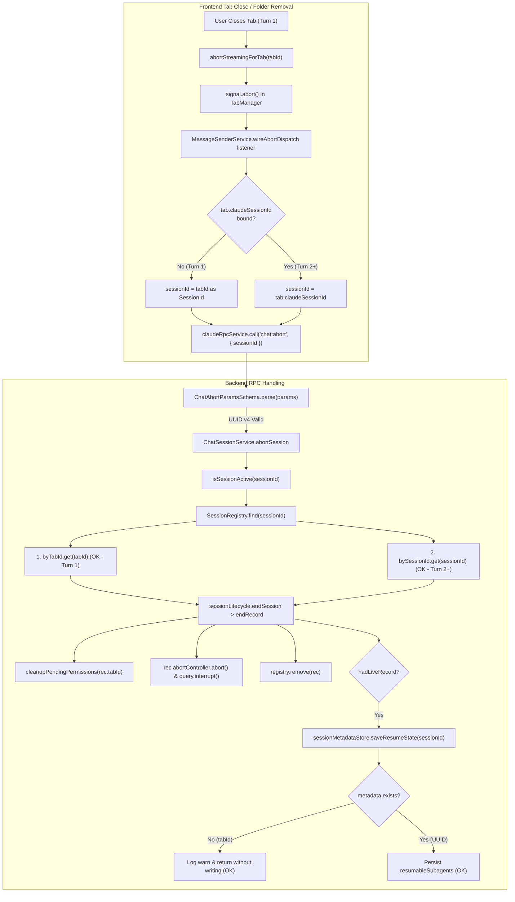

# Code Logic Review — `TASK_2026_592_a44d` (Follow-up Fix: MOD-3 & MIN-2)

**Reviewer**: Antigravity Lane (Cross-side review; author in-process)  
**Date**: 2026-10-02  
**Worktree**: `D:\projects\ptah-extension\.claude-worktrees\fix-close-tab-session`  
**Base Commit**: `c01099880`  
**Scope**: Uncommitted follow-up diff across `libs/frontend/chat` and `libs/frontend/core` (4 files: [`message-sender.service.ts`](file:///D:/projects/ptah-extension/.claude-worktrees/fix-close-tab-session/libs/frontend/chat/src/lib/services/message-sender.service.ts) + [`.spec.ts`](file:///D:/projects/ptah-extension/.claude-worktrees/fix-close-tab-session/libs/frontend/chat/src/lib/services/message-sender.service.spec.ts), [`electron-layout.service.ts`](file:///D:/projects/ptah-extension/.claude-worktrees/fix-close-tab-session/libs/frontend/core/src/lib/services/electron-layout.service.ts) + [`.spec.ts`](file:///D:/projects/ptah-extension/.claude-worktrees/fix-close-tab-session/libs/frontend/core/src/lib/services/electron-layout.service.spec.ts)).

---

## Summary

| Metric              | Value                                |
| ------------------- | ------------------------------------ |
| Overall score       | 8/10                                 |
| Assessment          | APPROVED                             |
| Blocking issues     | 0                                    |
| Serious issues      | 0                                    |
| Moderate issues     | 1                                    |
| Failure modes found | 2                                    |

### Score Justification (8/10 — Sound)
The follow-up changes cleanly and elegantly resolve both findings identified in the cross-side review:
1. **MOD-3**: Closing a tab during its first turn before `claudeSessionId` is bound now passes `tabId as SessionId` ([`message-sender.service.ts:226`](file:///D:/projects/ptah-extension/.claude-worktrees/fix-close-tab-session/libs/frontend/chat/src/lib/services/message-sender.service.ts#L226)). Independent tracing across the backend confirms that `tabId` is a UUID v4 matching [`ChatAbortParamsSchema`](file:///D:/projects/ptah-extension/.claude-worktrees/fix-close-tab-session/libs/backend/rpc-handlers/src/lib/handlers/chat-rpc.schema.ts#L103-L107), resolves the in-flight record in [`SessionRegistry.find()`](file:///D:/projects/ptah-extension/.claude-worktrees/fix-close-tab-session/libs/backend/agent-sdk/src/lib/helpers/session-lifecycle/session-registry.service.ts#L346-L348) via `byTabId`, triggers full query interrupt and permission cleanup, and safely skips durable resume serialization without writing corrupt metadata ([`session-metadata-store.ts:595-601`](file:///D:/projects/ptah-extension/.claude-worktrees/fix-close-tab-session/libs/backend/agent-sdk/src/lib/session-metadata-store.ts#L595-L601)).
2. **MIN-2**: In Electron folder removal, streaming sessions shared with remaining workspaces are excluded prior to prompting the user ([`electron-layout.service.ts:358-365`](file:///D:/projects/ptah-extension/.claude-worktrees/fix-close-tab-session/libs/frontend/core/src/lib/services/electron-layout.service.ts#L358-L365)). The confirmation dialog counts only sessions that will actually be terminated, and is bypassed entirely when all streaming sessions remain active in staying workspaces.

- **Separation from 9–10 (Exemplary)**: A pre-existing micro-window remains if the tab is closed immediately while `chat:start` RPC is in flight before [`SessionRegistry.register()`](file:///D:/projects/ptah-extension/.claude-worktrees/fix-close-tab-session/libs/backend/agent-sdk/src/lib/helpers/session-lifecycle/session-registry.service.ts#L226-L259) executes; and long pauses on confirmation modals do not refresh the streaming session list before dispatching aborts.
- **Separation from 5–6 (Works with gaps)**: Both bug fixes are completely verified, schemas and typings align with zero compiler warnings or errors, no duplicate aborts are introduced, and tests prove the failure modes are closed.

---

## Five Logic Questions

### 1. How does this fail silently?
- **Pre-Registration Tab Close**: If the user submits a prompt in a fresh tab and closes it in the narrow millisecond window before the backend RPC executes [`SessionRegistry.register()`](file:///D:/projects/ptah-extension/.claude-worktrees/fix-close-tab-session/libs/backend/agent-sdk/src/lib/helpers/session-lifecycle/session-registry.service.ts#L226), `chat:abort` arrives at [`SessionControl.endSession()`](file:///D:/projects/ptah-extension/.claude-worktrees/fix-close-tab-session/libs/backend/agent-sdk/src/lib/helpers/session-lifecycle/session-control.service.ts#L160-L167), finds no registered record, logs `"Session already ended, nothing to interrupt"`, and returns `'already-ended'`. Once `executeQuery()` proceeds, the SDK process starts without being terminated. (Pre-existing distributed race condition).
- **Turn-1 Resume State Logging**: In [`chat-session.service.ts:1001`](file:///D:/projects/ptah-extension/.claude-worktrees/fix-close-tab-session/libs/backend/rpc-handlers/src/lib/chat/session/chat-session.service.ts#L1001), `hadLiveRecord` evaluates to `true` for a turn-1 record, triggering `saveResumeState(tabId, ...)`. Inside [`session-metadata-store.ts:595-601`](file:///D:/projects/ptah-extension/.claude-worktrees/fix-close-tab-session/libs/backend/agent-sdk/src/lib/session-metadata-store.ts#L595-L601), `this.get(sessionId)` returns `undefined` (because metadata is keyed only by SDK UUID upon `init`). It logs a warning (`Cannot save resume state for missing session`) and exits cleanly. This produces no visible error, but no subagents on turn 1 could be resumed (expected, as subagents cannot spawn prior to turn 1 system `init`).

### 2. What user action produces unexpected behaviour?
- **Stale Confirmation Dialog upon Session Transition**: If a workspace folder has an active streaming session, the user clicks to remove the folder, and the confirmation dialog appears. If the stream completes in the background while the dialog is open, the message still states that the active streaming session will be aborted. If the user then confirms, `dispatchSessionAbort` is dispatched to an idle session, which is safely handled as a no-op by the backend.

### 3. What input data produces a wrong answer?
- None. `tabId` is generated using [`TabId.create()`](file:///D:/projects/ptah-extension/.claude-worktrees/fix-close-tab-session/libs/shared/src/lib/types/branded.types.ts#L189-L195) (RFC 4122 UUID v4), which satisfies `uuidString` regex validation in [`chat-rpc.schema.ts:42-47`](file:///D:/projects/ptah-extension/.claude-worktrees/fix-close-tab-session/libs/backend/rpc-handlers/src/lib/handlers/chat-rpc.schema.ts#L42-L47). In [`session-registry.service.ts:346-348`](file:///D:/projects/ptah-extension/.claude-worktrees/fix-close-tab-session/libs/backend/agent-sdk/src/lib/helpers/session-lifecycle/session-registry.service.ts#L346-L348), `byTabId` is a distinct lookup table from `bySessionId`; looking up a `tabId` will never accidentally resolve another tab's session record.

### 4. What happens when a dependency fails?
- **`chat:abort` Rejection**: In [`message-sender.service.ts:229-234`](file:///D:/projects/ptah-extension/.claude-worktrees/fix-close-tab-session/libs/frontend/chat/src/lib/services/message-sender.service.ts#L229-L234), `this.claudeRpcService.call('chat:abort', ...)` is guarded with `.catch()`. Any network failure or backend error logs a warning with `console.warn` and does not throw or block frontend tab disposal.
- **Backend Folder Removal Error**: In [`electron-layout.service.ts:386-403`](file:///D:/projects/ptah-extension/.claude-worktrees/fix-close-tab-session/libs/frontend/core/src/lib/services/electron-layout.service.ts#L386-L403), if `workspace:removeFolder` fails, `removeFolder()` logs an error and returns `false`, leaving all workspace partitions and layout intact.

### 5. What is missing that the requirements never mentioned?
- **Backend Early-Abort Tombstones**: The backend does not maintain an in-memory set of recently aborted `tabId`s to immediately discard arriving `chat:start` executions if abort arrives before registration.
- **Dynamic Re-Check in Confirm Dialog**: Re-evaluating `toAbort` immediately before executing abort dispatch if the confirmation modal sat open for a prolonged period.

---

## Failure Modes

### FM-1: Tab Close During Turn-1 Pre-Registration Window
- **Trigger**: Tab is closed within the microsecond window after sending `chat:start` but before `SessionQueryExecutorService.executeQuery` registers the record in `SessionRegistry`.
- **Symptom**: `chat:abort` returns `'already-ended'`; when `chat:start` finishes initialization, the Claude SDK process continues running orphaned in the background.
- **Evidence**: [`message-sender.service.ts:226`](file:///D:/projects/ptah-extension/.claude-worktrees/fix-close-tab-session/libs/frontend/chat/src/lib/services/message-sender.service.ts#L226), [`session-query-executor.service.ts:215-229`](file:///D:/projects/ptah-extension/.claude-worktrees/fix-close-tab-session/libs/backend/agent-sdk/src/lib/helpers/session-lifecycle/session-query-executor.service.ts#L215-L229), [`session-control.service.ts:161-167`](file:///D:/projects/ptah-extension/.claude-worktrees/fix-close-tab-session/libs/backend/agent-sdk/src/lib/helpers/session-lifecycle/session-control.service.ts#L161-L167).
- **Current Handling**: Handled as `'already-ended'`. (Occurs only in extreme race conditions).
- **Recommendation**: In a future task, pass an abort controller / cancellation token through the RPC layer directly into `startChatSession`.

### FM-2: Stale Confirmation Count on Prolonged Modal Prompt
- **Trigger**: Folder removal prompt is triggered while a stream is running; the stream naturally finishes before the user clicks "Close Workspace".
- **Symptom**: The dialog message claims a streaming session is active, but the session has already entered idle state.
- **Evidence**: [`electron-layout.service.ts:365-384`](file:///D:/projects/ptah-extension/.claude-worktrees/fix-close-tab-session/libs/frontend/core/src/lib/services/electron-layout.service.ts#L365-L384).
- **Current Handling**: `dispatchSessionAbort` is dispatched anyway. Since `abortSession` checks `isSessionActive`, it safely handles idle sessions without errors.
- **Recommendation**: Acceptable as-is; optional enhancement would be re-filtering `toAbort` post-confirmation.

---

## Blocking Issues
*None.*

---

## Serious Issues
*None.*

---

## Moderate and Minor Issues

### Moderate Issues
1. **[MOD-1] Registration Race on Instant Turn-1 Close** ([`message-sender.service.ts:226`](file:///D:/projects/ptah-extension/.claude-worktrees/fix-close-tab-session/libs/frontend/chat/src/lib/services/message-sender.service.ts#L226), [`session-query-executor.service.ts:219`](file:///D:/projects/ptah-extension/.claude-worktrees/fix-close-tab-session/libs/backend/agent-sdk/src/lib/helpers/session-lifecycle/session-query-executor.service.ts#L219)): Closing before backend `register()` executes results in `'already-ended'` return and subsequent process leak.

### Minor Issues
1. **[MIN-1] Stale Streaming State Across Long Confirm Await** ([`electron-layout.service.ts:366-381`](file:///D:/projects/ptah-extension/.claude-worktrees/fix-close-tab-session/libs/frontend/core/src/lib/services/electron-layout.service.ts#L366-L381)): Sessions that complete streaming while the confirm modal is open are still dispatched to `dispatchSessionAbort`.

---

## Data Flow Verification

---

## Detailed Verification of the 5 Checklist Invariants

### 1. Backend Trace for `chat:abort` with `tabId`
- **RPC Validation**: [`chat-rpc.schema.ts:103-107`](file:///D:/projects/ptah-extension/.claude-worktrees/fix-close-tab-session/libs/backend/rpc-handlers/src/lib/handlers/chat-rpc.schema.ts#L103-L107) validates `sessionId` using `uuidString('sessionId')`, testing against `UUID_REGEX` ([`chat-rpc.schema.ts:42-47`](file:///D:/projects/ptah-extension/.claude-worktrees/fix-close-tab-session/libs/backend/rpc-handlers/src/lib/handlers/chat-rpc.schema.ts#L42-L47)). Because `TabId.create()` produces standard UUID v4 strings ([`branded.types.ts:189-195`](file:///D:/projects/ptah-extension/.claude-worktrees/fix-close-tab-session/libs/shared/src/lib/types/branded.types.ts#L189-L195)), validation passes.
- **Registry Lookup**: In [`session-query-executor.service.ts:215-220`](file:///D:/projects/ptah-extension/.claude-worktrees/fix-close-tab-session/libs/backend/agent-sdk/src/lib/helpers/session-lifecycle/session-query-executor.service.ts#L215-L220), `registerKey = sessionConfig?.tabId ?? sessionId`. Registration stores `rec` in `byTabId` under `tabId`. [`session-registry.service.ts:346-348`](file:///D:/projects/ptah-extension/.claude-worktrees/fix-close-tab-session/libs/backend/agent-sdk/src/lib/helpers/session-lifecycle/session-registry.service.ts#L346-L348) resolves `this.byTabId.get(idOrTabId) ?? this.bySessionId.get(idOrTabId)`. Therefore, querying with `tabId` resolves the exact live record.
- **Accidental Collision / Overwrite**: `tabId` is unique per tab. `SessionRegistry` maps `byTabId` independently from `bySessionId`. In [`session-metadata-store.ts:595-601`](file:///D:/projects/ptah-extension/.claude-worktrees/fix-close-tab-session/libs/backend/agent-sdk/src/lib/session-metadata-store.ts#L595-L601), `this.get(tabId)` returns `undefined`, triggering early exit without touching the persistent storage blob. No garbage or overwrite can occur.

### 2. Side Effects of Passing `tabId`
- **Logging**: Cleanly logs `tabId` in [`ChatSessionService`](file:///D:/projects/ptah-extension/.claude-worktrees/fix-close-tab-session/libs/backend/rpc-handlers/src/lib/chat/session/chat-session.service.ts#L970) and [`SessionControl`](file:///D:/projects/ptah-extension/.claude-worktrees/fix-close-tab-session/libs/backend/agent-sdk/src/lib/helpers/session-lifecycle/session-control.service.ts#L215).
- **Pending Permissions**: Handled by `this.permissionHandler.cleanupPendingPermissions(rec.tabId)` ([`session-control.service.ts:244`](file:///D:/projects/ptah-extension/.claude-worktrees/fix-close-tab-session/libs/backend/agent-sdk/src/lib/helpers/session-lifecycle/session-control.service.ts#L244)), explicitly keyed by `rec.tabId`.
- **Subagent Cleanup**: Subagents are marked interrupted via `registrySessionId = rec.realSessionId ?? rec.tabId` ([`session-control.service.ts:216-247`](file:///D:/projects/ptah-extension/.claude-worktrees/fix-close-tab-session/libs/backend/agent-sdk/src/lib/helpers/session-lifecycle/session-control.service.ts#L216-L247)).
- **User Activity Buffering**: [`sdk-agent-adapter.ts:1450-1470`](file:///D:/projects/ptah-extension/.claude-worktrees/fix-close-tab-session/libs/backend/agent-sdk/src/lib/sdk-agent-adapter.ts#L1450-L1470) was pre-designed to buffer activity under `tabId` until resolved or flushed upon teardown under `tabId`, ensuring both ends of the lifecycle remain on the same key.

### 3. Fallback Trigger & Single Abort Invariant
- `const sessionId = tab?.claudeSessionId ?? (tabId as SessionId);` only evaluates to `tabId` when `claudeSessionId` is falsy.
- On tab close while streaming, `abortStreamingForTab(tabId)` sets `streamAbortDispatched: true` on the `ClosedTabEvent` ([`tab-manager.service.ts:958-974`](file:///D:/projects/ptah-extension/.claude-worktrees/fix-close-tab-session/libs/frontend/chat-state/src/lib/tab-manager.service.ts#L958-L974)).
- In [`closed-tab-session-ender.service.ts:55-57`](file:///D:/projects/ptah-extension/.claude-worktrees/fix-close-tab-session/libs/frontend/chat/src/lib/services/closed-tab-session-ender.service.ts#L55-L57), the ender skips because `streamAbortDispatched === true` (and additionally because `sessionId === null`). Thus, exactly one abort is dispatched.

### 4. MIN-2 Count Logic & Non-Aborting Folder Removal
- In [`electron-layout.service.ts:358-365`](file:///D:/projects/ptah-extension/.claude-worktrees/fix-close-tab-session/libs/frontend/core/src/lib/services/electron-layout.service.ts#L358-L365), `openElsewhere` extracts session IDs present in staying workspaces. `toAbort` filters out shared sessions.
- If all streaming sessions in the removed folder are shared with remaining folders, `toAbort.length === 0`. The confirm dialog is skipped, no streaming aborts are sent, `abortIdleSessionsOfRemovedFolder` skips the shared sessions ([`line 627-630`](file:///D:/projects/ptah-extension/.claude-worktrees/fix-close-tab-session/libs/frontend/core/src/lib/services/electron-layout.service.ts#L627-L630)), and folder removal completes successfully.
- This conforms to the project invariant: closing or removing a workspace folder must never interrupt sessions still displayed by other workspaces.

### 5. Verification Against Negative Tests
- Without the `message-sender.service.ts` fix: `tab?.claudeSessionId` was null on turn 1, returning early; [`message-sender.service.spec.ts:959-968`](file:///D:/projects/ptah-extension/.claude-worktrees/fix-close-tab-session/libs/frontend/chat/src/lib/services/message-sender.service.spec.ts#L959-L968) fails because `aborts` has length 0 instead of 1.
- Without the `electron-layout.service.ts` fix: confirm message reflected `streamingSessionIds.length` (2 instead of 1 in mixed shared tests), failing [`electron-layout.service.spec.ts:1990-1994`](file:///D:/projects/ptah-extension/.claude-worktrees/fix-close-tab-session/libs/frontend/core/src/lib/services/electron-layout.service.spec.ts#L1990-L1994); and fully-shared workspaces triggered `coordinator.confirm`, failing [`electron-layout.service.spec.ts:2002-2014`](file:///D:/projects/ptah-extension/.claude-worktrees/fix-close-tab-session/libs/frontend/core/src/lib/services/electron-layout.service.spec.ts#L2002-L2014).

---

## Requirements Fulfilment

| Requirement | Status | Gap |
| ----------- | ------ | --- |
| MOD-3: Tab close on Turn 1 aborts backend process | **COMPLETE** | None. Resolves process leak via `tabId` fallback. |
| MIN-2: Folder removal confirm dialog reflects actual abort count | **COMPLETE** | None. Excludes sessions shared with staying folders; skips confirm when 0 sessions abort. |

---

## Edge Cases

| Case | Handled | How | Concern |
| ---- | ------- | --- | ------- |
| Tab closed on turn 1 before session id is bound | YES | Falls back to `tabId as SessionId` in `wireAbortDispatch` ([`message-sender.service.ts:226`](file:///D:/projects/ptah-extension/.claude-worktrees/fix-close-tab-session/libs/frontend/chat/src/lib/services/message-sender.service.ts#L226)) | None |
| Tab closed on turn 2+ with bound session id | YES | Evaluates `tab?.claudeSessionId` first; sends real SDK UUID ([`message-sender.service.ts:226`](file:///D:/projects/ptah-extension/.claude-worktrees/fix-close-tab-session/libs/frontend/chat/src/lib/services/message-sender.service.ts#L226)) | None |
| Tab already removed from `tabs()` when listener executes | YES | Null-coalescing defaults to `tabId as SessionId` without throwing ([`message-sender.service.ts:226`](file:///D:/projects/ptah-extension/.claude-worktrees/fix-close-tab-session/libs/frontend/chat/src/lib/services/message-sender.service.ts#L226)) | None |
| Folder removed where all streaming sessions are shared elsewhere | YES | `toAbort.length === 0` skips confirmation modal and completes removal ([`electron-layout.service.ts:365`](file:///D:/projects/ptah-extension/.claude-worktrees/fix-close-tab-session/libs/frontend/core/src/lib/services/electron-layout.service.ts#L365)) | None |
| Folder removed with mixed shared and non-shared streaming sessions | YES | Only non-shared sessions are counted in dialog and passed to `dispatchSessionAbort` ([`electron-layout.service.ts:368-382`](file:///D:/projects/ptah-extension/.claude-worktrees/fix-close-tab-session/libs/frontend/core/src/lib/services/electron-layout.service.ts#L368-L382)) | None |

---

## Verdict

- **Recommendation**: **APPROVE**
- **Confidence**: **HIGH**
- **Top Risk**: Micro-window where user closes a turn-1 tab before the backend finishes RPC registration, resulting in `'already-ended'` without killing the subsequent SDK process.
- **What a Robust Implementation Would Add**:
  1. A backend cancellation registry that records early aborts for in-flight `chat:start` calls before query execution starts.
