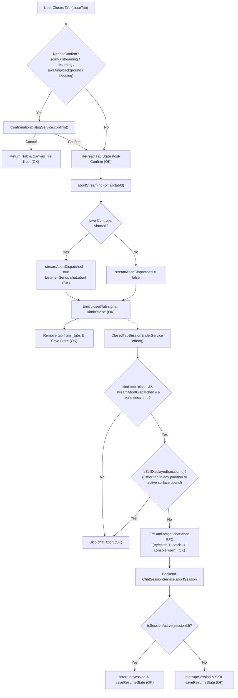

# Code Logic Review — `TASK_2026_592_a44d`

**Reviewer**: Antigravity Lane (Cross-side review; authors were in-process sub-agents)  
**Date**: 2026-10-02  
**Worktree**: `D:\projects\ptah-extension\.claude-worktrees\fix-close-tab-session`  
**Base Commit**: `95cb1de78`  
**Branch**: `fix/close-tab-ends-session`  
**Scope**: Full git diff across `libs/` and `apps/` (21 files, including 9 production files and 12 spec suites).

---

## Summary

| Metric              | Value                                |
| ------------------- | ------------------------------------ |
| Overall score       | 8/10                                 |
| Assessment          | APPROVED                             |
| Blocking issues     | 0                                    |
| Serious issues      | 0                                    |
| Moderate issues     | 3                                    |
| Minor issues        | 3                                    |
| Failure modes found | 4                                    |

### Score Justification (8/10 — Sound)
The implementation across all four batches is sound, defensive, and well-structured. It honors architectural boundaries (decoupling `@ptah-extension/chat-state` from backend RPCs, introducing `ClosedTabSessionEnderService` as an eager root singleton in `@ptah-extension/chat`, using `IWorkspaceCoordinator` for cross-workspace session accounting in `@ptah-extension/core`, and protecting resume state in `@ptah-extension/rpc-handlers`). Prior findings from in-process reviews (such as S1 shared streaming aborts and canvas tile dropping on cancel) were cleanly resolved with dedicated regression tests.

- **Separation from 9–10 (Exemplary)**: `closedTab` uses a single-value signal that inherently coalesces if multiple tabs close in a single tick; Electron folder removal does not inspect unvisited workspace tab storage; and closing a tab on turn 1 before `chat:start` resolves can still orphan a process.
- **Separation from 5–6 (Works with gaps)**: All five mandatory user requirements hold completely; error boundaries prevent any RPC failure from throwing or blocking UI close; streaming closes send exactly one abort; and no workspace switch ever triggers an abort.

---

## User Requirements Checklist

| # | Requirement | Status | Evidence (file:line) |
|---|-------------|--------|----------------------|
| 1 | **Workspace SWITCH never ends any session** (user switches between multi-project sessions on purpose) | **PASS** | [`tab-workspace-partition.service.ts`](file:///D:/projects/ptah-extension/.claude-worktrees/fix-close-tab-session/libs/frontend/chat-state/src/lib/tab-workspace-partition.service.ts) parks/restores tab arrays without emitting `_closedTab`; [`electron-layout.service.ts:445-500`](file:///D:/projects/ptah-extension/.claude-worktrees/fix-close-tab-session/libs/frontend/core/src/lib/services/electron-layout.service.ts#L445-L500) `switchWorkspace` only calls `workspace:switchFolder` and never calls `chat:abort`. Verified in [`tab-manager.cross-workspace.spec.ts:145-199`](file:///D:/projects/ptah-extension/.claude-worktrees/fix-close-tab-session/libs/frontend/chat-state/src/lib/tab-manager.cross-workspace.spec.ts#L145-L199), [`closed-tab-session-ender.service.spec.ts:306-335`](file:///D:/projects/ptah-extension/.claude-worktrees/fix-close-tab-session/libs/frontend/chat/src/lib/services/closed-tab-session-ender.service.spec.ts#L306-L335), and [`electron-layout.service.spec.ts:2026-2041`](file:///D:/projects/ptah-extension/.claude-worktrees/fix-close-tab-session/libs/frontend/core/src/lib/services/electron-layout.service.spec.ts#L2026-L2041). |
| 2 | **Pop-out transfer (`forceCloseTab`) and `/clear` reset (`resetTabToFresh`) never end the session** | **PASS** | [`tab-manager.service.ts:889-893`](file:///D:/projects/ptah-extension/.claude-worktrees/fix-close-tab-session/libs/frontend/chat-state/src/lib/tab-manager.service.ts#L889-L893) emits `kind: 'forceClose'`; [`tab-manager.service.ts:1055-1059`](file:///D:/projects/ptah-extension/.claude-worktrees/fix-close-tab-session/libs/frontend/chat-state/src/lib/tab-manager.service.ts#L1055-L1059) emits `kind: 'reset'`. [`closed-tab-session-ender.service.ts:54`](file:///D:/projects/ptah-extension/.claude-worktrees/fix-close-tab-session/libs/frontend/chat/src/lib/services/closed-tab-session-ender.service.ts#L54) filters with `if (closed.kind !== 'close') return;`. Verified in [`closed-tab-session-ender.service.spec.ts:145-159`](file:///D:/projects/ptah-extension/.claude-worktrees/fix-close-tab-session/libs/frontend/chat/src/lib/services/closed-tab-session-ender.service.spec.ts#L145-L159). |
| 3 | **A session still shown by another tab, canvas tile or surface in the same webview is not ended** (orchestrator note after PR #628 review: the checks below see only the current webview's `TabManagerService`; a session shown in a separate webview — VS Code sidebar plus an editor panel — is not detected. That cross-webview case is an accepted limitation, `batches.md` "Cross-webview twin", recoverable by `autoResumeIfInactive`) | **PASS (current webview only)** | [`closed-tab-session-ender.service.ts:58-83`](file:///D:/projects/ptah-extension/.claude-worktrees/fix-close-tab-session/libs/frontend/chat/src/lib/services/closed-tab-session-ender.service.ts#L58-L83) `isStillDisplayed`: checks `findTabBySessionId` (scans active tabs + all background workspace partitions + canvas tiles) and `conversations.findContainingSession` + `binding.surfacesFor`. In Electron folder removal, [`electron-layout.service.ts:376-382`](file:///D:/projects/ptah-extension/.claude-worktrees/fix-close-tab-session/libs/frontend/core/src/lib/services/electron-layout.service.ts#L376-L382) and [`electron-layout.service.ts:627-633`](file:///D:/projects/ptah-extension/.claude-worktrees/fix-close-tab-session/libs/frontend/core/src/lib/services/electron-layout.service.ts#L627-L633) skip sessions present in `sessionIdsOpenIn(remainingFolders)`. In [`canvas.store.ts:244-246`](file:///D:/projects/ptah-extension/.claude-worktrees/fix-close-tab-session/libs/frontend/canvas/src/lib/canvas.store.ts#L244-L246), cancelled tile close retains tile and focus. |
| 4 | **Closing a tab never throws or blocks because of the RPC** | **PASS** | [`tab-manager.service.ts:917-994`](file:///D:/projects/ptah-extension/.claude-worktrees/fix-close-tab-session/libs/frontend/chat-state/src/lib/tab-manager.service.ts#L917-L994) does not await RPC; `ClosedTabSessionEnderService` runs asynchronously via Angular `effect()`. In [`closed-tab-session-ender.service.ts:61-67`](file:///D:/projects/ptah-extension/.claude-worktrees/fix-close-tab-session/libs/frontend/chat/src/lib/services/closed-tab-session-ender.service.ts#L61-L67), the call is guarded by try/catch and `.catch()`, logging via `console.warn`. Verified in [`closed-tab-session-ender.service.spec.ts:211-253`](file:///D:/projects/ptah-extension/.claude-worktrees/fix-close-tab-session/libs/frontend/chat/src/lib/services/closed-tab-session-ender.service.spec.ts#L211-L253). |
| 5 | **A streaming close sends exactly one `chat:abort`** | **PASS** | [`tab-manager.service.ts:958`](file:///D:/projects/ptah-extension/.claude-worktrees/fix-close-tab-session/libs/frontend/chat-state/src/lib/tab-manager.service.ts#L958) `abortStreamingForTab` aborts the controller and returns `true`, triggering MessageSender's abort listener. `streamAbortDispatched: true` is placed on `ClosedTabEvent`. [`closed-tab-session-ender.service.ts:55`](file:///D:/projects/ptah-extension/.claude-worktrees/fix-close-tab-session/libs/frontend/chat/src/lib/services/closed-tab-session-ender.service.ts#L55) checks `if (closed.streamAbortDispatched === true) return;`. Backend [`chat-session.service.ts:976-1005`](file:///D:/projects/ptah-extension/.claude-worktrees/fix-close-tab-session/libs/backend/rpc-handlers/src/lib/chat/session/chat-session.service.ts#L976-L1005) `hadLiveRecord` guard ensures resume state is not overwritten even on redundant aborts. |

---

## Five Logic Questions

### 1. How does this fail silently?
1. **Signal Coalescing on Rapid Sequential Closes**: [`tab-manager.service.ts:969`](file:///D:/projects/ptah-extension/.claude-worktrees/fix-close-tab-session/libs/frontend/chat-state/src/lib/tab-manager.service.ts#L969) writes `_closedTab.set(...)`. If two tabs are closed synchronously in the same macrotask/microtask tick, the second write replaces the first. The Angular `effect()` in [`closed-tab-session-ender.service.ts:46-51`](file:///D:/projects/ptah-extension/.claude-worktrees/fix-close-tab-session/libs/frontend/chat/src/lib/services/closed-tab-session-ender.service.ts#L46-L51) only processes the second event, silently failing to send `chat:abort` for the first tab and leaving its `claude.exe` process running indefinitely.
2. **RPC Failure on Idle Close**: [`closed-tab-session-ender.service.ts:62-67`](file:///D:/projects/ptah-extension/.claude-worktrees/fix-close-tab-session/libs/frontend/chat/src/lib/services/closed-tab-session-ender.service.ts#L62-L67) catches errors and logs `console.warn`. The UI closes smoothly and reports success to the user, but the background SDK process remains active if the backend rejected or dropped the RPC.
3. **Turn 1 Early Close**: If a user submits a prompt in a fresh tab and closes it before the backend returns the `init` message, `tab.claudeSessionId` is null. Neither MessageSender nor the ender sends an abort. When `chat:start` completes, the SDK process runs orphaned in the background.

### 2. What user action produces unexpected behaviour?
1. **Deleting a Background Session Shows Two Dialogs**: When a user deletes a session from Session History via [`app-shell.component.ts:621`](file:///D:/projects/ptah-extension/.claude-worktrees/fix-close-tab-session/libs/frontend/chat/src/lib/components/templates/app-shell.component.ts#L621), the user confirms "Delete this session?". After deletion succeeds, `closeTab(tabId)` is called. Because [`tab-manager.service.ts:927-928`](file:///D:/projects/ptah-extension/.claude-worktrees/fix-close-tab-session/libs/frontend/chat-state/src/lib/tab-manager.service.ts#L927-L928) now prompts for `awaiting-background` and `sleeping` tabs, the user receives an unexpected second prompt: *"This session has unsaved changes, is streaming, or has background work running... Close anyway?"*.
2. **Folder Removal Streaming Confirm Overcount**: If workspace A and workspace B share a streaming session, removing workspace A shows a confirm dialog stating "This workspace has 1 active streaming session... Closing it will abort it", even though the session will remain running in workspace B.

### 3. What input data produces a wrong answer?
1. **Multi-Session Conversation with Non-Tab Surface Bound**: In [`closed-tab-session-ender.service.ts:79-82`](file:///D:/projects/ptah-extension/.claude-worktrees/fix-close-tab-session/libs/frontend/chat/src/lib/services/closed-tab-session-ender.service.ts#L79-L82), `this.conversations.findContainingSession(sessionId)` returns the parent conversation record. If the conversation has branched or compacted across multiple session IDs and a surface (e.g. wizard/harness) is bound to the conversation, closing an older session's tab suppresses the abort. The old SDK process remains alive instead of being reaped.

### 4. What happens when a dependency fails?
1. **`ClaudeRpcService.call('chat:abort')` Rejects or Times Out**: Caught by `.catch()` and logged to `console.warn` ([`closed-tab-session-ender.service.ts:62`](file:///D:/projects/ptah-extension/.claude-worktrees/fix-close-tab-session/libs/frontend/chat/src/lib/services/closed-tab-session-ender.service.ts#L62)) or `console.error` ([`electron-layout.service.ts:677`](file:///D:/projects/ptah-extension/.claude-worktrees/fix-close-tab-session/libs/frontend/core/src/lib/services/electron-layout.service.ts#L677)). The caller is unaffected, tab removal completes, and layout state persists cleanly.
2. **`ConfirmationDialogService.confirm` Cancels**: In [`canvas.store.ts:244-246`](file:///D:/projects/ptah-extension/.claude-worktrees/fix-close-tab-session/libs/frontend/canvas/src/lib/canvas.store.ts#L244-L246), `closeTab` returns without removing the tab; `removeTile` detects the tab is still present in `tabs()` and returns early, preserving tile state and focus.

### 5. What is missing that the requirements never mentioned?
1. **App Exit / Window Close Disposal**: Closing tabs ends sessions, but exiting the desktop application or closing the browser/VS Code window without closing tabs relies entirely on OS process termination; no window unload reaper sends bulk aborts.
2. **Backend Idle Timeout Reaper**: There is no backend reaper for idle SDK agent processes if an abort is missed due to UI crashes or network interruptions.
3. **Resumable State Restoration on Unresumed Continue**: After app restart, if a restored tab continues without explicitly calling `chat:resume`, the durable resumable subagent list is not restored to the in-memory registry before turn execution, causing the session-end subscriber to overwrite the durable list with `[]`.

---

## Failure Modes

### FM-1: Silent Session Process Leak via Signal Coalescing
- **Trigger**: Multiple tabs closed in the same synchronous execution block (e.g., future batch closers or rapid programmatic loop).
- **Symptom**: `_closedTab.set()` overwrites preceding events; `ClosedTabSessionEnderService`'s Angular effect only triggers for the final event. Unhandled tabs leave `claude.exe` processes running indefinitely.
- **Evidence**: [`tab-manager.service.ts:969`](file:///D:/projects/ptah-extension/.claude-worktrees/fix-close-tab-session/libs/frontend/chat-state/src/lib/tab-manager.service.ts#L969), [`closed-tab-session-ender.service.ts:43-50`](file:///D:/projects/ptah-extension/.claude-worktrees/fix-close-tab-session/libs/frontend/chat/src/lib/services/closed-tab-session-ender.service.ts#L43-L50).
- **Current Handling**: Comment acknowledging the limitation. No existing caller closes multiple tabs in one tick (dead closers were deleted in Batch 1).
- **Recommendation**: Upgrade `closedTab` to an event queue (e.g. `signal<readonly ClosedTabEvent[]>`) if batch tab closing is reintroduced.

### FM-2: Premature Termination of Shared Session from Unvisited Workspace
- **Trigger**: Workspace A has session S saved in localStorage from a previous session, but workspace A was never switched to during this app run. Workspace B also contains session S. The user removes workspace B in Electron.
- **Symptom**: `sessionIdsOpenIn` queries `coordinator.getSessionIds('/path/to/a')`, which returns `[]` because workspace A has not yet loaded its partition into memory. Session S is aborted even though workspace A holds it.
- **Evidence**: [`electron-layout.service.ts:650-661`](file:///D:/projects/ptah-extension/.claude-worktrees/fix-close-tab-session/libs/frontend/core/src/lib/services/electron-layout.service.ts#L650-L661), [`tab-workspace-partition.service.ts:182-200`](file:///D:/projects/ptah-extension/.claude-worktrees/fix-close-tab-session/libs/frontend/chat-state/src/lib/tab-workspace-partition.service.ts#L182-L200).
- **Current Handling**: Comment in `electron-layout.service.ts:646-649` noting that an unvisited workspace cannot own a live process in this run.
- **Recommendation**: Query the partition service's persisted storage cache when checking `sessionIdsOpenIn`.

### FM-3: Orphaned Backend Process on Rapid First-Turn Close
- **Trigger**: User starts a fresh tab, sends a prompt, and immediately closes the tab before the backend stream resolves `sdkMessage.session_id`.
- **Symptom**: `tab.claudeSessionId` is null at close. Neither MessageSender nor ClosedTabSessionEnder sends `chat:abort`. The backend spawns `claude.exe` and leaves it running orphaned.
- **Evidence**: [`message-sender.service.ts:223-226`](file:///D:/projects/ptah-extension/.claude-worktrees/fix-close-tab-session/libs/frontend/chat/src/lib/services/message-sender.service.ts#L223-L226), [`tab-manager.service.ts:971`](file:///D:/projects/ptah-extension/.claude-worktrees/fix-close-tab-session/libs/frontend/chat-state/src/lib/tab-manager.service.ts#L971).
- **Current Handling**: None; existing pre-task behavior.
- **Recommendation**: Attach an abort registration keyed on `tabId` so late-resolving backend sessions can be terminated if the tab was closed before resolution.

### FM-4: Unpersisted Interrupted Subagents After `retireInterruptedRecord`
- **Trigger**: Turn interrupt times out; `retireInterruptedRecord` marks subagents interrupted but emits no session-end event. Tab is subsequently closed.
- **Symptom**: `abortSession` checks `isSessionActive(sessionId)`, which returns `false` (record was retired). The new `if (hadLiveRecord)` guard skips `saveResumeState`, so interrupted subagents are not persisted to disk.
- **Evidence**: [`chat-session.service.ts:976-1004`](file:///D:/projects/ptah-extension/.claude-worktrees/fix-close-tab-session/libs/backend/rpc-handlers/src/lib/chat/session/chat-session.service.ts#L976-L1004), [`session-control.service.ts:123-148`](file:///D:/projects/ptah-extension/.claude-worktrees/fix-close-tab-session/libs/backend/agent-sdk/src/lib/helpers/session-lifecycle/session-control.service.ts#L123-L148).
- **Current Handling**: Guard checks `hadLiveRecord`.
- **Recommendation**: Guard on `hadLiveRecord || subagentRegistry.getResumableBySession(sessionId).length > 0`.

---

## Blocking Issues
*None.*

---

## Serious Issues
*None.*

---

## Moderate and Minor Issues

### Moderate Issues
1. **[MOD-1] Signal coalescing on rapid sequential tab close** ([`tab-manager.service.ts:969`](file:///D:/projects/ptah-extension/.claude-worktrees/fix-close-tab-session/libs/frontend/chat-state/src/lib/tab-manager.service.ts#L969), [`closed-tab-session-ender.service.ts:43-50`](file:///D:/projects/ptah-extension/.claude-worktrees/fix-close-tab-session/libs/frontend/chat/src/lib/services/closed-tab-session-ender.service.ts#L43-L50)): Single-value signal drops close events if multiple tabs close in a single tick.
2. **[MOD-2] Unvisited workspace tabs invisible during Electron folder removal** ([`electron-layout.service.ts:650-661`](file:///D:/projects/ptah-extension/.claude-worktrees/fix-close-tab-session/libs/frontend/core/src/lib/services/electron-layout.service.ts#L650-L661)): `getSessionIds` only checks in-memory partitions, ignoring unvisited workspace storage.
3. **[MOD-3] Turn 1 early close orphans backend process** ([`tab-manager.service.ts:971`](file:///D:/projects/ptah-extension/.claude-worktrees/fix-close-tab-session/libs/frontend/chat-state/src/lib/tab-manager.service.ts#L971), [`message-sender.service.ts:223-226`](file:///D:/projects/ptah-extension/.claude-worktrees/fix-close-tab-session/libs/frontend/chat/src/lib/services/message-sender.service.ts#L223-L226)): Closing before `sessionId` is bound skips abort.

### Minor Issues
1. **[MIN-1] Double confirmation prompt on session deletion** ([`app-shell.component.ts:621`](file:///D:/projects/ptah-extension/.claude-worktrees/fix-close-tab-session/libs/frontend/chat/src/lib/components/templates/app-shell.component.ts#L621), [`tab-manager.service.ts:927-928`](file:///D:/projects/ptah-extension/.claude-worktrees/fix-close-tab-session/libs/frontend/chat-state/src/lib/tab-manager.service.ts#L927-L928)): `closeTab` prompts again for `awaiting-background` and `sleeping` tabs after user already confirmed session deletion.
2. **[MIN-2] Confirmation dialog count overstates aborted sessions** ([`electron-layout.service.ts:356-370`](file:///D:/projects/ptah-extension/.claude-worktrees/fix-close-tab-session/libs/frontend/core/src/lib/services/electron-layout.service.ts#L356-L370)): Counts streaming sessions that are shared with remaining workspaces and will not be aborted.
3. **[MIN-3] Expired resumable records linger in durable store on idle close** ([`chat-session.service.ts:1000-1004`](file:///D:/projects/ptah-extension/.claude-worktrees/fix-close-tab-session/libs/backend/rpc-handlers/src/lib/chat/session/chat-session.service.ts#L1000-L1004)): Skipping `saveResumeState` when `hadLiveRecord === false` leaves expired records in disk storage until the next live run.

---

## Data Flow Verification

---

## Edge Cases

| Case | Handled | How | Concern |
|------|---------|-----|---------|
| Tab closed with null / empty session ID | YES | Early exit in `ClosedTabSessionEnderService` ([`service.ts:57`](file:///D:/projects/ptah-extension/.claude-worktrees/fix-close-tab-session/libs/frontend/chat/src/lib/services/closed-tab-session-ender.service.ts#L57)) | None |
| Session open in multiple tabs across partitions | YES | `tabManager.findTabBySessionId` checks all partitions ([`service.ts:78`](file:///D:/projects/ptah-extension/.claude-worktrees/fix-close-tab-session/libs/frontend/chat/src/lib/services/closed-tab-session-ender.service.ts#L78)) | None |
| Session displayed in non-tab surface (wizard/harness) | YES | Checked via `conversations.findContainingSession` and `binding.surfacesFor` ([`service.ts:79-82`](file:///D:/projects/ptah-extension/.claude-worktrees/fix-close-tab-session/libs/frontend/chat/src/lib/services/closed-tab-session-ender.service.ts#L79-L82)) | None |
| Confirmation dialog cancelled on canvas tile | YES | `canvas.store.ts:245` verifies tab presence before removing tile | None |
| Multiple sequential tab closes | YES | Sequential closes each flush and trigger an abort | Coalescing risk if in same tick (MOD-1) |
| Workspace folder removal with mixed streaming & idle tabs | YES | Streaming aborted first; idle aborted after backend success; de-duplicated via `skip` set ([`electron-layout.service.ts:627-632`](file:///D:/projects/ptah-extension/.claude-worktrees/fix-close-tab-session/libs/frontend/core/src/lib/services/electron-layout.service.ts#L627-L632)) | None |
| Removing only workspace folder | YES | Handled via `coordinator.clearWorkspace()` ([`electron-layout.service.ts:427`](file:///D:/projects/ptah-extension/.claude-worktrees/fix-close-tab-session/libs/frontend/core/src/lib/services/electron-layout.service.ts#L427)) | None |
| Abort RPC rejects or throws synchronously | YES | Non-blocking try/catch and `.catch()` logging with `console.warn` / `console.error` | None |
| Stale tab across confirmation dialog await | YES | Re-read `this._tabs().find()` post-await ([`tab-manager.service.ts:948-950`](file:///D:/projects/ptah-extension/.claude-worktrees/fix-close-tab-session/libs/frontend/chat-state/src/lib/tab-manager.service.ts#L948-L950)) | None |
| Session closed unopened after app restart | YES | `hadLiveRecord` guard prevents wiping durable resume state ([`chat-session.service.ts:1000`](file:///D:/projects/ptah-extension/.claude-worktrees/fix-close-tab-session/libs/backend/rpc-handlers/src/lib/chat/session/chat-session.service.ts#L1000)) | None |

---

## Verdict

- **Recommendation**: **APPROVE**
- **Confidence**: **HIGH**
- **Top Risk**: A single-value `closedTab` signal will coalesce if any future batch tab close executes in a single tick, silently leaking an SDK `claude.exe` process.
- **What a Robust Implementation Would Add**:
  1. An event queue for `closedTab` (or array signal) to eliminate signal coalescing during multi-tab closures.
  2. Persistent storage partition lookup in `sessionIdsOpenIn` to cover unvisited workspaces during folder removal.
  3. Pre-bind tab-level abort registration to cancel in-flight `chat:start` when closing a fresh tab during turn 1.
