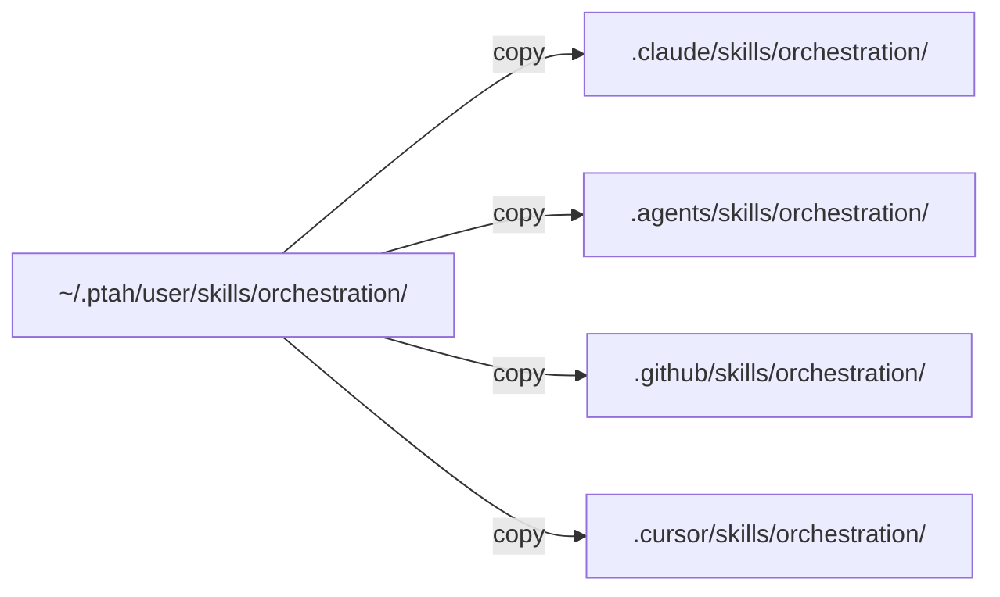

A **skill** is a small, focused prompt package with a deterministic trigger. When the model decides a skill is relevant, its contents are injected into context on the spot. Skills are how Ptah keeps expertise modular: one skill per topic, versioned, and reusable across providers.

## What a skill looks like

```text
skills/
└── review-security/
    ├── SKILL.md              # Definition + trigger description
    └── references/           # Optional lazy-loaded content
        ├── owasp-top-10.md
        └── threat-model.md
```

```markdown title="SKILL.md"
---
name: review-security
description: Security vulnerability review — OWASP-based assessment across any tech stack. Use when the user asks for a security review or mentions vulnerabilities, auth, or hardening.
---

# Security Review Protocol

## Phase 1: Authentication & authorization

...
```

## How Ptah decides which skill to invoke

Every skill's `description` field is the trigger. The orchestrator scans available skills and picks the ones whose descriptions match the user's intent. Matching is LLM-based, not keyword-based, so phrasing matters:

- **Good:** _"Use when the user writes Angular forms, reactive forms, or form validation."_
- **Poor:** _"Angular forms stuff."_

:::tip
Concrete verbs and nouns in the description dramatically improve skill discovery. Aim for "when to use" rather than "what it does."
:::

## Harness sync — sharing across AI clients

Ptah goes beyond its own sessions. It keeps one editable copy of each skill in
the user layer at `~/.ptah/user/skills/<skill-name>/`, then reconciles that
layer out to every AI tool it detects on your machine.

**The reconciler writes real files, not links.** Earlier versions used symbolic
links and Windows junctions. They are gone. Each target directory now holds a
manifest-owned copy, so a tool that cannot follow a link still reads the skill.

| Target(s)             | Directory                         |
| --------------------- | --------------------------------- |
| Claude                | `.claude/skills/<slug>/`          |
| Codex and Antigravity | `.agents/skills/<slug>/` (shared) |
| Copilot               | `.github/skills/<slug>/`          |
| Cursor                | `.cursor/skills/<slug>/`          |

Only the tools you have installed get a copy. An undetected tool is not a gap.


```mermaid
flowchart LR
    A["~/.ptah/user/skills/orchestration/"] -- copy --> B[".claude/skills/orchestration/"]
    A -- copy --> C[".agents/skills/orchestration/"]
    A -- copy --> D[".github/skills/orchestration/"]
    A -- copy --> E[".cursor/skills/orchestration/"]
```

### Reconcile lifecycle

| Event                  | Ptah's action                                            |
| ---------------------- | -------------------------------------------------------- |
| Plugin enabled         | Copy every skill in the plugin into each detected target |
| Plugin disabled        | Delete the copies (the source stays in the user layer)   |
| Plugin updated         | Rewrite each copy whose content hash changed             |
| Workspace first opened | Reconcile the workspace against the user layer           |

Ptah owns only the paths its manifest records. A skill directory you created by
hand is foreign, and the reconciler leaves it alone. Ptah also writes a
`.gitignore` entry for the directories it derives, because those copies must not
be committed. Edit the source in `~/.ptah/user/skills/`, never a copy.

## Skill vs. agent — when to use which

| Skill                                              | Agent                                                     |
| -------------------------------------------------- | --------------------------------------------------------- |
| Knowledge pack injected into current context       | Separate sub-session with its own context window          |
| No token isolation                                 | Token-isolated — good for large background work           |
| Invoked automatically when description matches     | Invoked explicitly via `ptah_agent_spawn` or orchestrator |
| Best for: patterns, checklists, reference material | Best for: multi-step execution, long-running tasks        |

## Auto-discovered skills

Beyond hand-authored skills, Ptah can **generate skills from your own usage**. The [Skill Synthesis](/skill-synthesis/) pipeline watches sessions for repeated successful trajectories and, after the 3rd success, materialises a `SKILL.md` at `~/.ptah/skills/<slug>/`. From that point the auto-skill participates in the same discovery, harness sync, and trigger-matching as any hand-authored skill — there's no second runtime path.

You can review, force-promote, or reject candidates in **Settings → Skill Synthesis**.

## Next steps

- [Browse the popular skill catalog](/mcp-and-skills/popular-skills/)
- [Create your own skill](/mcp-and-skills/creating-skills/)
- [How auto-discovered skills work](/skill-synthesis/)
