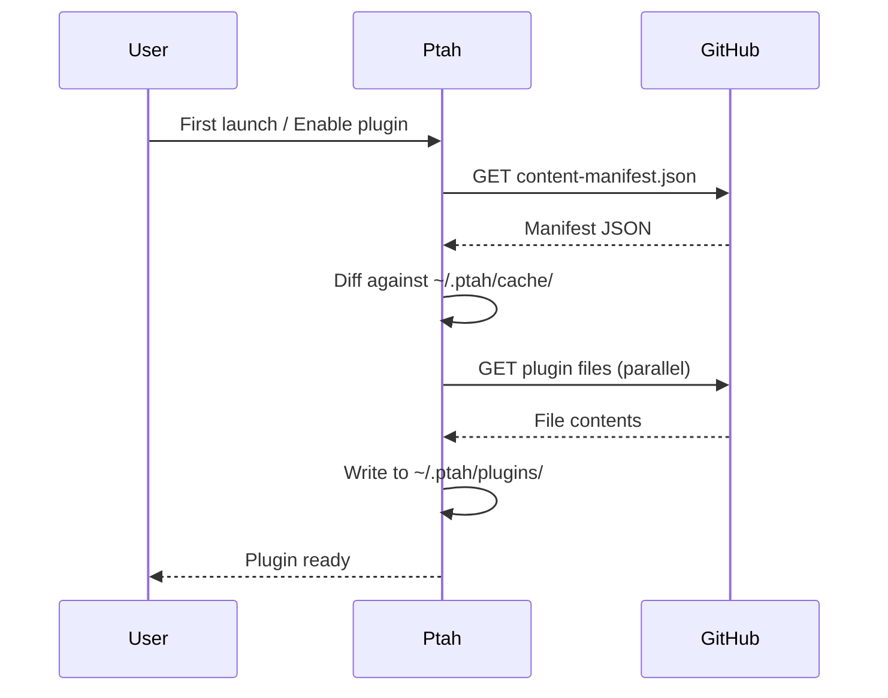

Ptah keeps the desktop installer small by **not bundling plugins**. Instead, a dedicated `ContentDownloadService` fetches plugins from the public GitHub repository the first time they're needed and caches them under your home directory.

## Storage layout

```text
~/.ptah/
├── plugins/
│   ├── ptah-core/
│   │   ├── .claude-plugin/plugin.json
│   │   ├── commands/
│   │   └── skills/
│   ├── ptah-angular/
│   ├── ptah-react/
│   └── ptah-nx-saas/
├── templates/
├── settings.json
└── cache/
    └── content-manifest.json
```

| Path                                  | Purpose                                               |
| ------------------------------------- | ----------------------------------------------------- |
| `~/.ptah/plugins/`                    | Downloaded plugin source trees                        |
| `~/.ptah/templates/`                  | Downloaded project templates                          |
| `~/.ptah/cache/content-manifest.json` | Last-seen manifest (used for diff + offline fallback) |
| `~/.ptah/settings.json`               | Global settings (provider keys, plugin preferences)   |

:::note
On Windows the `~` resolves to `%USERPROFILE%` (e.g. `C:\Users\<you>\.ptah\`). On macOS/Linux it's `$HOME/.ptah/`.
:::

## The content manifest

At the root of the [Ptah repository](https://github.com/Hive-Academy/ptah-extension) lives `content-manifest.json`. It is the single source of truth for everything downloadable:

```json
{
  "$schema": "https://ptah.live/schemas/content-manifest.json",
  "version": "1.0.0",
  "contentHash": "sha256:016322ac9c...",
  "baseUrl": "https://raw.githubusercontent.com/Hive-Academy/ptah-extension/main",
  "plugins": {
    "basePath": "apps/ptah-extension-vscode/assets/plugins",
    "files": ["ptah-core/.claude-plugin/plugin.json", "ptah-core/commands/orchestrate.md", "ptah-angular/skills/angular-frontend-patterns/SKILL.md"]
  },
  "templates": {
    "basePath": "libs/backend/agent-generation/templates",
    "files": ["agents/frontend-developer.md", "agents/security-auditor.md"]
  }
}
```

The manifest is regenerated by `scripts/generate-content-manifest.js` on every release. Its `contentHash` lets Ptah detect whether a re-download is needed.

## The download flow



Key properties:

- **Parallel downloads** with a concurrency cap (default 8) to respect rate limits.
- **Content-addressed caching** — files with unchanged hashes are skipped.
- **Graceful offline mode** — if GitHub is unreachable, Ptah uses whatever is already cached.
- **Integrity verification** — each file's size and hash are validated before it's written.

## Offline behavior

If you launch Ptah with no internet:

- Already-downloaded plugins continue to work.
- The marketplace shows your cached plugin list with an **Offline** banner.
- New plugin installs and updates are queued and retried automatically when connectivity returns.

## Inspecting the cache

Use the command palette to inspect or clear storage:

| Command                          | Effect                                                      |
| -------------------------------- | ----------------------------------------------------------- |
| `Ptah: Open Plugin Cache Folder` | Opens `~/.ptah/plugins/` in your file manager               |
| `Ptah: Clear Plugin Cache`       | Deletes `~/.ptah/plugins/` and re-downloads enabled plugins |
| `Ptah: Show Content Manifest`    | Opens the last-downloaded manifest                          |

## Next steps

- [Create your own plugin](/plugins/creating-plugins/)
- [Template storage](/templates/template-storage/)
