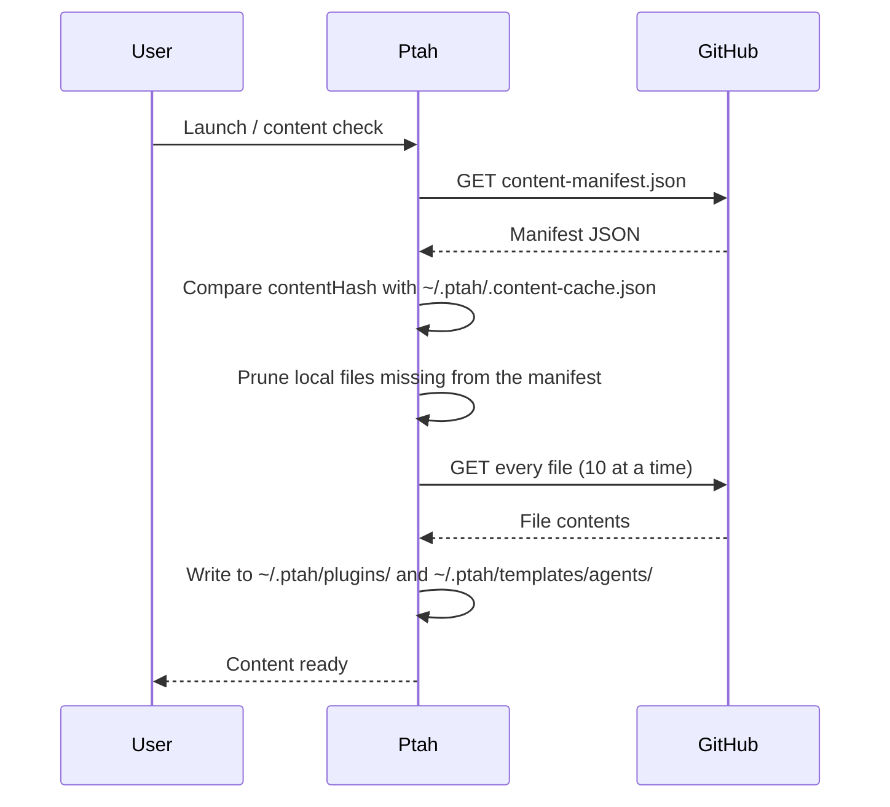

Ptah keeps the desktop installer small by **not bundling plugins**. Instead, a dedicated `ContentDownloadService` fetches plugins from the public GitHub repository and caches them under your home directory.

## Storage layout

```text
~/.ptah/
├── plugins/
│   ├── ptah-core/
│   │   ├── .claude-plugin/plugin.json
│   │   ├── commands/
│   │   └── skills/
│   ├── ptah-nx-saas/
│   ├── ptah-angular/
│   ├── ptah-react/
│   └── ptah-video/
├── templates/
│   └── agents/
├── settings.json
└── .content-cache.json
```

| Path                          | Purpose                                                    |
| ----------------------------- | ---------------------------------------------------------- |
| `~/.ptah/plugins/`            | Downloaded plugin source trees                             |
| `~/.ptah/templates/agents/`   | Downloaded agent templates                                 |
| `~/.ptah/.content-cache.json` | Cache metadata: last-seen `contentHash`, timestamp, counts |
| `~/.ptah/settings.json`       | Global settings (provider keys and other preferences)      |

Note that `.content-cache.json` is a small metadata record — it is **not** a copy of the manifest. Ptah stores the hash it last downloaded, not the file list.

:::note
On Windows the `~` resolves to `%USERPROFILE%` (e.g. `C:\Users\<you>\.ptah\`). On macOS/Linux it's `$HOME/.ptah/`.
:::

## The content manifest

At the root of the [Ptah repository](https://github.com/Hive-Academy/ptah-extension) lives `content-manifest.json`. It is the single source of truth for everything downloadable:

```json
{
  "$schema": "https://ptah.live/schemas/content-manifest.json",
  "version": "1.0.0",
  "contentHash": "sha256:016322ac9c...",
  "baseUrl": "https://raw.githubusercontent.com/Hive-Academy/ptah-extension/main",
  "plugins": {
    "basePath": "apps/ptah-extension-vscode/assets/plugins",
    "files": ["ptah-core/.claude-plugin/plugin.json", "ptah-core/commands/orchestrate.md", "ptah-angular/skills/angular-frontend-patterns/SKILL.md"]
  },
  "templates": {
    "basePath": "libs/backend/agent-generation/templates",
    "files": ["agents/frontend-developer.md", "agents/security-auditor.md"]
  }
}
```

The manifest is regenerated by `scripts/generate-content-manifest.js`. Its single `contentHash` covers the whole thing.

## The download flow


```mermaid
sequenceDiagram
    participant User
    participant Ptah
    participant GitHub

    User->>Ptah: Launch / content check
    Ptah->>GitHub: GET content-manifest.json
    GitHub-->>Ptah: Manifest JSON
    Ptah->>Ptah: Compare contentHash with ~/.ptah/.content-cache.json
    Ptah->>Ptah: Prune local files missing from the manifest
    Ptah->>GitHub: GET every file (10 at a time)
    GitHub-->>Ptah: File contents
    Ptah->>Ptah: Write to ~/.ptah/plugins/ and ~/.ptah/templates/agents/
    Ptah-->>User: Content ready
```

Key properties:

- **One hash, all or nothing.** There is exactly one `contentHash`, for the whole manifest. If it matches your cached value, Ptah downloads nothing and reports the cached counts. If it differs, **every file in the manifest is downloaded again** — Ptah has no per-file hash and cannot tell which one changed.
- **Parallel downloads** in batches of **10**, so a manifest of a few hundred markdown files finishes quickly without hammering GitHub.
- **Stale-file pruning.** Before downloading, Ptah walks `~/.ptah/plugins/` and `~/.ptah/templates/agents/` and deletes files the manifest no longer lists — but only **inside the parts of those trees the manifest actually populates**. For plugins that means the five bundled plugin directories; a file under `ptah-harness-my-skill/`, or any other directory the manifest never mentions, is left alone. For templates, whose manifest is a flat list, it means the template files themselves. So a skill removed from `ptah-core` upstream is swept on the next refresh, while your own content in the same tree is not. The trade-off is deliberate: a whole plugin directory dropped from the manifest upstream is no longer swept and lingers until you delete it, because from disk alone Ptah cannot tell it apart from something you authored. A stale directory is recoverable; your work is not.
- **Atomic writes.** Each file is written to `<path>.tmp` and renamed into place, so an interrupted download can't leave a half-written `SKILL.md` behind.
- **Path-traversal guard.** Every destination path is resolved and checked to be inside the target directory before anything is written. A manifest entry like `../../evil.md` is rejected with an error rather than escaping `~/.ptah/`. This is the real integrity property: Ptah verifies _where_ a file lands, not what it contains.
- **Redirect-following, timeout-bounded fetches.** Up to five redirects; a request that stalls for 30 seconds is aborted.
- **Failures are per file.** A file that fails to download is logged and counted; the rest of the batch still completes. The result reports how many failed.

## Offline behaviour

If you launch Ptah with no internet:

- Already-downloaded plugins continue to work — junctions point at local directories and never touch the network.
- The manifest fetch fails, the content check returns a failure result, and Ptah moves on.

There is **no retry queue.** A failed download is not scheduled for later; the next content check simply tries again from the top. If content looks missing after an offline session, trigger another check by restarting Ptah.

## Inspecting the cache

There are no Ptah commands for the cache — inspect it with your file manager or shell.

| To do this               | Do                                                                                 |
| ------------------------ | ---------------------------------------------------------------------------------- |
| See what's downloaded    | Open `~/.ptah/plugins/`                                                            |
| Check the cached hash    | Open `~/.ptah/.content-cache.json`                                                 |
| Force a full re-download | Delete `~/.ptah/.content-cache.json` — the next check finds no match and refetches |

## Next steps

- [Change your selection later](/plugins/managing/)
- [Create your own plugin](/plugins/creating-plugins/)
- [Template storage](/templates/template-storage/)
