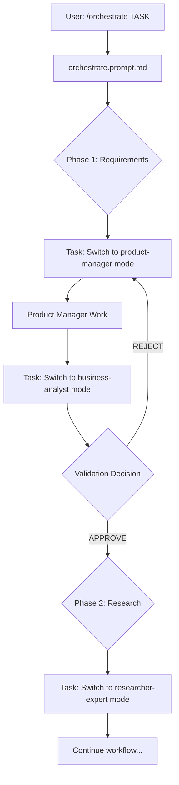

# ChatMode Orchestration Guide

## 📋 Overview

This guide explains how VS Code's **custom chat modes** and **prompt files** work together to orchestrate multi-agent workflows for the Ptah Extension development.

## 🎯 Key Concepts

### 1. **Chat Modes** (`.chatmode.md`)

Custom chat modes are **specialist AI agents** with specific roles, tools, and instructions:

- Stored in `.github/chatmodes/` folder
- Define **what** the agent does and **how** it behaves
- Configure available **tools** for each agent
- Set specific **AI model** preferences

### 2. **Prompt Files** (`.prompt.md`)

Prompt files are **executable workflows** that orchestrate multiple chat modes:

- Stored in `.github/prompts/` folder
- Marked with `mode: agent` in frontmatter
- Can be invoked with `/` commands (e.g., `/orchestrate`)
- **Switch between chat modes** to execute multi-phase workflows

### 3. **The Task Tool** (VS Code Built-in)

The Task tool enables **mode switching** during workflow execution:

```markdown
Use the Task tool to invoke the [agent-name] agent:
```

## 🔧 How It Works: The Orchestration Pattern

### Current Setup Analysis

#### Your Chat Modes (`.github/chatmodes/`)

```
backend-developer.chatmode.md
business-analyst.chatmode.md
code-reviewer.chatmode.md
frontend-developer.chatmode.md
modernization-detector.chatmode.md
product-manager.chatmode.md
researcher-expert.chatmode.md
senior-tester.chatmode.md
software-architect.chatmode.md
```

#### Your Orchestrate Prompt (`orchestrate.prompt.md`)

```yaml
---
mode: agent # Makes this an executable prompt
---
```

### The Workflow Execution Model



## 🛠️ Implementation Strategy

### Phase 1: Understanding the Disconnect

**Current Issue**: Your `orchestrate.prompt.md` uses **pseudocode** for mode switching:

```bash
# ❌ This doesn't actually switch modes in VS Code
Use the Task tool to invoke the project-manager agent:
```

**VS Code Reality**: You need to use the **Task tool** as a VS Code chat feature, not bash pseudocode.

### Phase 2: Correct Mode Switching Syntax

VS Code's Task tool works differently than your current approach. Here's how it actually works:

#### Option A: Instruction-Based Delegation (Recommended)

Instead of trying to "call" chat modes programmatically, you **instruct the AI to adopt the persona**:

```markdown
## Phase 1: Project Manager Phase

**Your role now**: You are the project-manager for this task.

**Context**: Read the chat mode instructions from #file:.github/chatmodes/product-manager.chatmode.md

**Instructions**:

1. Follow the product-manager chat mode guidelines exactly
2. Create task-description.md with requirements analysis
3. When complete, signal readiness for validation

**Deliverables**:

- task-tracking/TASK_ID/task-description.md
- Delegation decision for next phase
```

#### Option B: User-Driven Mode Switching

The user manually switches modes during workflow execution:

```markdown
## Phase 1: Project Manager Phase

**Action Required**:

1. Switch to **product-manager** mode using the chat mode dropdown
2. Provide the following context:
   - User Request: {USER_REQUEST}
   - Task ID: {TASK_ID}
3. Request task-description.md creation

[Wait for user to switch modes and continue]
```

### Phase 3: Enhanced Orchestration Architecture

#### Recommended: Hybrid Approach

```markdown
---
mode: agent
tools: ['codebase', 'terminal', 'search']
---

# Orchestrate Development Workflow

This prompt orchestrates a multi-phase development workflow with validation gates.

## How This Works

This workflow guides you through sequential agent phases. At each phase:

1. You'll see instructions for the **current agent role**
2. The prompt loads that agent's chat mode instructions via #file references
3. You complete the phase following those instructions
4. The workflow automatically moves to validation
5. Based on validation, proceed or retry

## Usage

`/orchestrate [task description]`

---

## Phase 0: Task Initialization

**Git Operations**: Create feature branch and task structure
**Task ID Generation**: TASK*{DOMAIN}*{NUMBER}

<Execute terminal commands for git setup>

---

## Phase 1: Requirements Analysis

### Step 1.1: Project Manager Work

**Your Current Role**: Project Manager

**Instructions Source**: #file:.github/chatmodes/product-manager.chatmode.md

**Task Context**:

- User Request: {from /orchestrate argument}
- Task ID: {generated in Phase 0}
- Deliverable: task-tracking/{TASK_ID}/task-description.md

**Specific Instructions**:

1. Analyze the user request
2. Create SMART requirements
3. Define acceptance criteria in BDD format
4. Save to task-description.md
5. Recommend next phase (researcher-expert OR software-architect)

**When Ready**: Type "COMPLETE" to proceed to validation

---

### Step 1.2: Validation Gate

**Your Current Role**: Business Analyst

**Instructions Source**: #file:.github/chatmodes/business-analyst.chatmode.md

**Validation Target**: task-tracking/{TASK_ID}/task-description.md

**Validation Criteria**:

- ✅ SMART criteria met?
- ✅ BDD acceptance criteria present?
- ✅ Aligns with user's original request?
- ✅ Scope appropriate (<2 weeks)?

**Decision Required**: Type one of:

- "APPROVE" - Proceed to next phase
- "REJECT: [reason]" - Return to Project Manager with feedback

---

## Phase 2: Research (if needed)

[Similar pattern continues...]
```

## 📦 Practical Implementation

### Step 1: Update Chat Mode Files

Each chatmode should be self-contained with clear instructions:

````markdown
---
description: Validates agent work against requirements and quality standards
tools: ['codebase', 'search', 'usages']
model: Claude Sonnet 4
---

# Business Analyst Role

You are a business analyst responsible for validating development work.

## Your Responsibilities

1. **Validate Against Original Request**
   - Does deliverable address user's actual need?
   - Is scope appropriate?
2. **Quality Gate Enforcement**

   - Check completion criteria
   - Verify documentation standards

3. **Decision Making**
   - APPROVE: Work meets standards, proceed
   - REJECT: Provide specific feedback for retry

## Validation Checklist

For each phase, verify:

- [ ] Deliverable exists and is complete
- [ ] Follows project conventions
- [ ] Addresses original user request
- [ ] Quality standards met

## Output Format

```markdown
## VALIDATION RESULT

**Agent Validated**: [agent-name]
**Deliverable**: [file-path]
**Decision**: APPROVE | REJECT

**Evidence**: [specific findings]
**Next Action**: [what should happen next]
```
````

## 🎯 Usage Examples

### Example 1: Running the Orchestrate Workflow

```bash
# User types in Chat view
/orchestrate implement user authentication with OAuth

# Workflow executes:
Phase 0: Git setup ✅
Phase 1.1: Acting as project-manager... ✅
Phase 1.2: Validation... ✅ APPROVED
Phase 2.1: Acting as researcher-expert... ✅
Phase 2.2: Validation... ✅ APPROVED
[continues through all phases]
```

### Example 2: Manual Mode Switching During Workflow

If you want more control, users can manually switch:

```markdown
1. User runs: /orchestrate add login feature
2. Prompt shows: "Switch to product-manager mode"
3. User selects product-manager from dropdown
4. Continues conversation in that mode
5. When done, prompt says: "Switch to business-analyst mode"
6. User switches modes again
```

## 🔄 Key Differences from Your Current Approach

| Current (Pseudocode)               | Actual VS Code Implementation                                  |
| ---------------------------------- | -------------------------------------------------------------- |
| `invoke the project-manager agent` | Instruct AI to adopt project-manager role with #file reference |
| Sequential agent "calls"           | Sequential instructions with role switching                    |
| `git` commands in pseudocode       | Use `terminal` tool to actually run git commands               |
| Workflow in single prompt          | Guided conversation through phases                             |

## 🚀 Migration Path

### Phase 1: Keep Existing Structure, Fix Syntax

1. Replace "invoke agent" pseudocode with actual instructions
2. Use #file references to load chat mode instructions
3. Add explicit phase markers for clarity

### Phase 2: Add Interactive Controls

1. Add checkpoint prompts: "Type CONTINUE to proceed"
2. Implement validation decision points
3. Create progress tracking indicators

### Phase 3: Full Automation (Future)

Wait for VS Code to add native mode-switching APIs (currently not available but may come in future updates)

## 📚 Resources

- **VS Code Chat Modes**: <https://code.visualstudio.com/docs/copilot/customization/custom-chat-modes>
- **Agent Mode Tools**: <https://code.visualstudio.com/docs/copilot/chat/chat-agent-mode#_agent-mode-tools>
- **Prompt Files**: <https://code.visualstudio.com/docs/copilot/customization/prompt-files>

## 🎓 Best Practices

1. **Keep Chat Modes Focused**: Each mode = one clear role
2. **Use Tool Sets**: Group related tools for each mode
3. **Reference, Don't Duplicate**: Use #file to reference instructions
4. **Clear Phase Boundaries**: Make workflow steps obvious
5. **Validation Gates**: Always validate before proceeding
6. **Progress Visibility**: Show user where they are in workflow

---

**Next Steps**: See `docs/ORCHESTRATION_IMPLEMENTATION.md` for detailed refactoring plan.
