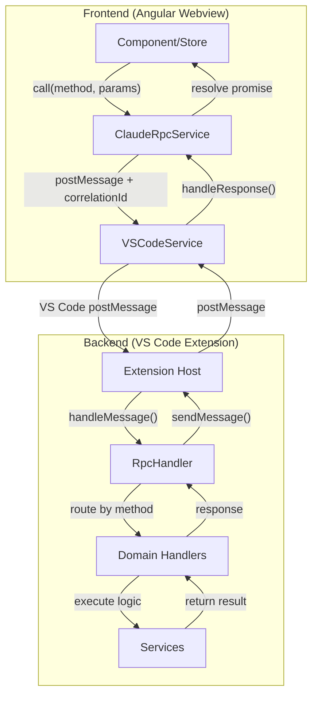

# RPC Messaging System Documentation

> **Comprehensive analysis of the ptah-extension RPC infrastructure with performance optimization recommendations**

---

## Executive Summary

The ptah-extension uses a robust RPC (Remote Procedure Call) messaging system for communication between the Angular webview frontend and the VS Code extension backend. The system is built on VS Code's native `postMessage` API with custom abstractions for type safety, correlation tracking, and domain-specific handler organization.

---

## Architecture Overview



---

## Core Components

### 1. Backend: RpcHandler

**Location:** `libs/backend/vscode-core/src/messaging/rpc-handler.ts`

The central routing component for all RPC method calls.

| Feature            | Implementation                      |
| ------------------ | ----------------------------------- |
| **Routing**        | Map-based lookup O(1)               |
| **Security**       | Whitelist validation (15 prefixes)  |
| **Error Handling** | try/catch with structured responses |
| **Logging**        | TSyringe injectable Logger          |

**Allowed Method Prefixes:**

```typescript
const ALLOWED_METHOD_PREFIXES = ['session:', 'chat:', 'file:', 'workspace:', 'analytics:', 'provider:', 'config:', 'context:', 'autocomplete:', 'permission:', 'auth:', 'setup-status:', 'setup-wizard:', 'llm:', 'license:'];
```

**Key Methods:**

- `registerMethod<TParams, TResult>(name, handler)` - Register type-safe handler
- `handleMessage(message)` - Route and execute RPC call
- `unregisterMethod(name)` - Remove handler
- `getRegisteredMethods()` - Introspection

---

### 2. Frontend: ClaudeRpcService

**Location:** `libs/frontend/core/src/lib/services/claude-rpc.service.ts`

Promise-based RPC client with correlation tracking.

| Feature             | Value                                      |
| ------------------- | ------------------------------------------ |
| **Default Timeout** | 30,000ms                                   |
| **Correlation**     | UUID-based correlationId                   |
| **Type Safety**     | RpcMethodRegistry generics                 |
| **Result Wrapper**  | RpcResult class with isSuccess()/isError() |

> **Note on Timeouts:** The timeout is a _maximum wait time_, not a delay. If a method responds in 100ms, the promise resolves immediately - it does NOT wait the remaining 29.9 seconds. The timeout only triggers if no response is received within the limit.

---

### 3. Bridge: VSCodeService

**Location:** `libs/frontend/core/src/lib/services/vscode.service.ts`

Mediates between Angular and VS Code's webview API.

**Message Types Routed:**

| Message Type          | Destination                         |
| --------------------- | ----------------------------------- |
| `rpc:response`        | ClaudeRpcService.handleResponse()   |
| `chat:chunk`          | ChatStore.processExecutionNode()    |
| `chat:complete`       | ChatStore.handleChatComplete()      |
| `chat:error`          | ChatStore.handleChatError()         |
| `session:id-resolved` | ChatStore.handleSessionIdResolved() |
| `permission:request`  | ChatStore.handlePermissionRequest() |
| `agent:summary-chunk` | ChatStore.handleAgentSummaryChunk() |
| `session:stats`       | ChatStore.handleSessionStats()      |

---

### 4. Domain Handlers

| Handler                 | Location                                | RPC Methods                                                                                                                     |
| ----------------------- | --------------------------------------- | ------------------------------------------------------------------------------------------------------------------------------- |
| ChatRpcHandlers         | `handlers/chat-rpc.handlers.ts`         | `chat:start`, `chat:continue`, `chat:abort`                                                                                     |
| SessionRpcHandlers      | `handlers/session-rpc.handlers.ts`      | `session:list`, `session:load`                                                                                                  |
| FileRpcHandlers         | `handlers/file-rpc.handlers.ts`         | `file:open`                                                                                                                     |
| ContextRpcHandlers      | `handlers/context-rpc.handlers.ts`      | `context:getAllFiles`, `context:getFileSuggestions`                                                                             |
| AutocompleteRpcHandlers | `handlers/autocomplete-rpc.handlers.ts` | `autocomplete:agents`, `autocomplete:commands`                                                                                  |
| AuthRpcHandlers         | `handlers/auth-rpc.handlers.ts`         | `auth:check`, `auth:saveSettings`, `auth:getAuthStatus`                                                                         |
| SetupRpcHandlers        | `handlers/setup-rpc.handlers.ts`        | `setup-status:get`, `setup-wizard:launch`                                                                                       |
| ConfigRpcHandlers       | `handlers/config-rpc.handlers.ts`       | `config:model:set`, `config:model:get`, `config:autopilot:get`, `config:models:list`                                            |
| LlmRpcHandlers          | `handlers/llm-rpc.handlers.ts`          | `llm:getProviderStatus`, `llm:setApiKey`, `llm:removeApiKey`, `llm:getActiveProvider`, `llm:setActiveProvider`, `llm:getModels` |
| LicenseRpcHandlers      | `handlers/license-rpc.handlers.ts`      | `license:getStatus`                                                                                                             |

---

## Type System

### RPC Types

**Location:** `libs/backend/vscode-core/src/messaging/rpc-types.ts`

```typescript
interface RpcMessage<TParams = unknown> {
  method: string; // e.g., 'session:list'
  params: TParams; // Type-safe parameters
  correlationId: string; // UUID for matching
}

interface RpcResponse<T = unknown> {
  success: boolean;
  data?: T; // Present if success=true
  error?: string; // Present if success=false
  correlationId: string;
}
```

### Shared Types

**Location:** `libs/shared/src/lib/types/rpc.types.ts`

Contains 121+ interface definitions for all RPC method parameters and results.

---

## Performance Characteristics

### Strengths ✅

| Aspect             | Implementation        | Performance Impact         |
| ------------------ | --------------------- | -------------------------- |
| **Handler Lookup** | Map.get()             | O(1) constant time         |
| **Type Safety**    | Compile-time generics | Zero runtime overhead      |
| **Security**       | Prefix whitelist      | Minimal startsWith() check |
| **Async Design**   | Promise-based         | Non-blocking handlers      |
| **Correlation**    | UUID-based matching   | O(1) Map lookup            |

### Current Bottlenecks ⚠️

| Issue                   | Impact                                   | Notes                    |
| ----------------------- | ---------------------------------------- | ------------------------ |
| **No Message Batching** | Multiple round-trips for related calls   | Good optimization target |
| **JSON Serialization**  | CPU overhead for large payloads          | VS Code limitation       |
| **Console Logging**     | Need to verify environment-based control | May already be in place  |

---

## Recommended Optimization

### Message Batching for UI Initialization

**Status:** Recommended for implementation

Combine multiple startup RPC calls to reduce round-trips:

```typescript
// Current: Sequential calls
const settings = await rpc.call('config:model:get', {});
const status = await rpc.call('llm:getProviderStatus', {});
const sessions = await rpc.call('session:list', { workspacePath });

// Proposed: Batch call
const results = await rpc.callBatch([
  { method: 'config:model:get', params: {} },
  { method: 'llm:getProviderStatus', params: {} },
  { method: 'session:list', params: { workspacePath } },
]);
```

**Backend support:**

```typescript
// New batch handler
rpcHandler.registerMethod<BatchRequest, BatchResult>('rpc:batch', async (params) => {
  const results = await Promise.all(params.calls.map((call) => this.handleMessage(call)));
  return results;
});
```

**Expected Impact:** Reduces initial page load round-trips from N to 1.

---

## Action Items

### ✅ Logging - FIXED

**1. Log Level Filtering** - Implemented in `libs/backend/vscode-core/src/logging/logger.ts`:

- **Production:** Defaults to `info` level (debug messages filtered out)
- **Development:** Logs all levels when:
  - `VSCODE_DEBUG_MODE=true` (F5 debugging)
  - `NODE_ENV=development`
  - `PTAH_LOG_LEVEL=debug` (explicit override)

**2. WebviewManager Converted** - `libs/backend/vscode-core/src/api-wrappers/webview-manager.ts`:

- Replaced ~10 direct `console.log/warn/error` calls with injected Logger
- Now properly filtered by log level

**3. Remaining Console Usage (Intentional)**:

| File                        | Reason                                                           |
| --------------------------- | ---------------------------------------------------------------- |
| `main.ts`                   | Bootstrap logging before Logger is initialized                   |
| `webview-html-generator.ts` | Console logs in webview startup script (runs in browser context) |
| Various JSDoc examples      | Documentation examples, not runtime code                         |

### 📋 Pending Tasks

- [x] **Log level filtering** - Implemented ✅
- [x] **WebviewManager console audit** - Fixed ✅
- [ ] **Message batching** - Created as [TASK_2025_083](task-tracking/TASK_2025_083/task-description.md)

---

## Files Reference

### Core Infrastructure

- `libs/backend/vscode-core/src/messaging/rpc-handler.ts` - Backend routing
- `libs/backend/vscode-core/src/messaging/rpc-types.ts` - Backend types
- `libs/frontend/core/src/lib/services/claude-rpc.service.ts` - Frontend client
- `libs/frontend/core/src/lib/services/vscode.service.ts` - Message bridge
- `libs/shared/src/lib/types/rpc.types.ts` - Shared type definitions
- `libs/shared/src/lib/types/message.types.ts` - MESSAGE_TYPES constants

### Handler Files

- `apps/ptah-extension-vscode/src/services/rpc/rpc-method-registration.service.ts`
- `apps/ptah-extension-vscode/src/services/rpc/handlers/*.ts` (11 files)
