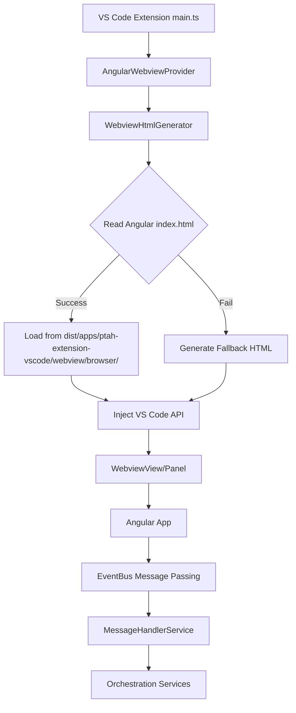

# Angular ↔ VS Code Extension Integration Analysis

**Task ID**: TASK_INT_002  
**Created**: October 15, 2025  
**Status**: 🔴 **CRITICAL INTEGRATION ISSUE DETECTED**

---

## 🚨 CRITICAL FINDING: Build Output Path Mismatch

### Problem Summary

The **Angular webview build output** and the **VS Code extension's asset loading logic** are **completely misaligned**, preventing the extension from loading the webview.

### Evidence

#### 1. **Angular Build Configuration** (`apps/ptah-extension-webview/project.json`)

```json
{
  "targets": {
    "build": {
      "executor": "@angular/build:application",
      "options": {
        "outputPath": "dist/apps/ptah-extension-vscode/webview",  // ✅ CORRECT
        "browser": "apps/ptah-extension-webview/src/main.ts"
      }
    }
  }
}
```

**Expected Output**: `dist/apps/ptah-extension-vscode/webview/browser/`

#### 2. **Webview HTML Generator** (`webview-html-generator.ts`)

```typescript
// INCORRECT PATH - Looking in 'out/webview/browser'
const appDistPath = path.join(this.context.extensionPath, 'out', 'webview', 'browser');
```

**Actual Location**: Angular builds are NOT going to `out/webview/browser/`

#### 3. **Current Build Output** (Verified)

```bash
dist/apps/ptah-extension-vscode/
├── main.js          # ✅ Extension bundle (webpack)
├── main.js.map      # ✅ Extension source map
└── webview/         # ❌ MISSING - Angular build FAILED
    └── browser/     # ❌ MISSING - Expected Angular output
```

**Status**: Webview folder does NOT exist due to build budget errors.

#### 4. **Angular Build Errors**

```text
✗ [ERROR] libs/frontend/chat/src/lib/components/chat-messages-list/chat-messages-list.component.scss 
  exceeded maximum budget. Budget 8.00 kB was not met by 262 bytes with a total of 8.26 kB.

✗ [ERROR] libs/frontend/chat/src/lib/components/chat-messages/components/chat-message-content/
  chat-message-content.component.scss exceeded maximum budget. Budget 8.00 kB was not met by 2.82 kB 
  with a total of 10.82 kB.

▲ [WARNING] bundle initial exceeded maximum budget. Budget 500.00 kB was not met by 42.86 kB 
  with a total of 542.86 kB.
```

**Root Cause**: CSS component styles exceeding budget limits causing build to fail.

---

## 🔍 Integration Architecture Analysis

### Extension ↔ Webview Communication Flow



### Current Implementation Details

#### 1. **Webview Provider Initialization**

**File**: `apps/ptah-extension-vscode/src/providers/angular-webview.provider.ts`

**Architecture**: ✅ **EventBus-based** (MONSTER plan compliant)

```typescript
export class AngularWebviewProvider implements vscode.WebviewViewProvider {
  constructor(
    private context: vscode.ExtensionContext,
    private sessionManager: SessionManager,
    private claudeService: ClaudeCliService,
    private contextManager: ContextManager,
    private commandBuilderService: CommandBuilderService,
    private analyticsDataCollector: AnalyticsDataCollector,
    private eventBus: EventBus,  // ✅ Uses EventBus
    private providerManager?: ProviderManager
  ) {
    this.htmlGenerator = new WebviewHtmlGenerator(context);
    this.initializeDevelopmentWatcher();
  }
}
```

**Features**:

- ✅ Hot reload during development (file watcher)
- ✅ EventBus message publishing for webview → extension
- ✅ Type-safe message handling via `WebviewMessage`
- ✅ Dual mode: WebviewView (sidebar) + WebviewPanel (full screen)

#### 2. **Resource Loading Configuration**

**File**: `apps/ptah-extension-vscode/src/providers/angular-webview.provider.ts`

```typescript
webviewView.webview.options = {
  enableScripts: true,
  localResourceRoots: [
    vscode.Uri.joinPath(
      this.context.extensionUri,
      'dist',
      'apps',
      'ptah-extension-vscode',
      'webview',
      'browser'
    ),
    vscode.Uri.joinPath(this.context.extensionUri, 'media'),
    vscode.Uri.joinPath(this.context.extensionUri, 'dist'),
  ],
};
```

**Status**: ✅ **Correct paths** (matches Angular build output)

#### 3. **HTML Generation Strategy**

**File**: `apps/ptah-extension-vscode/src/services/webview-html-generator.ts`

**Strategy**: Read actual `index.html` from Angular dist and transform URIs

```typescript
private _getHtmlForWebview(webview: vscode.Webview, workspaceInfo?: any): string {
  // ❌ INCORRECT PATH
  const appDistPath = path.join(this.context.extensionPath, 'out', 'webview', 'browser');
  
  // ✅ SHOULD BE:
  // const appDistPath = path.join(
  //   this.context.extensionPath, 
  //   'dist', 
  //   'apps', 
  //   'ptah-extension-vscode', 
  //   'webview', 
  //   'browser'
  // );
}
```

**URI Transformation**: Uses regex pattern `/(src|href)="([^"]+)"/g` to transform all asset paths.

#### 4. **Content Security Policy (CSP)**

```typescript
private getImprovedCSP(webview: vscode.Webview, nonce: string): string {
  return `default-src 'none'; 
          img-src ${webview.cspSource} https: data: blob:; 
          script-src 'nonce-${nonce}' 'unsafe-eval'; 
          style-src ${webview.cspSource} 'nonce-${nonce}' https://fonts.googleapis.com; 
          font-src ${webview.cspSource} https://fonts.gstatic.com https://fonts.googleapis.com data:;
          connect-src 'self' ${webview.cspSource};
          frame-src 'none';
          object-src 'none';
          base-uri 'self' ${webview.cspSource};`;
}
```

**Status**: ✅ **Secure and Angular-compatible** (allows Google Fonts, no unsafe-inline)

---

## 📊 MONSTER Plan Integration Status

### Backend Infrastructure (Weeks 1-6) ✅ COMPLETE

**Integration Points with Webview**:

1. **EventBus** (`libs/backend/vscode-core/src/messaging/event-bus.ts`)
   - ✅ RxJS Observable-based message routing
   - ✅ Type-safe with `MessagePayloadMap`
   - ✅ Webview messages published with `source: 'webview'`

2. **Shared Types** (`libs/shared/src/lib/types/`)
   - ✅ `WebviewMessage` interface
   - ✅ `StrictChatMessage` and `StrictChatSession`
   - ✅ Branded types: `SessionId`, `MessageId`, `ProviderId`

3. **Provider System** (`libs/backend/ai-providers-core/`)
   - ✅ `ProviderManager` exposes state via RxJS `BehaviorSubject`
   - ✅ Angular can subscribe to provider changes
   - ⚠️ **No UI contracts yet** (planned in TASK_PRV_006)

### Frontend Progress (Week 7-9) 🔄 IN PROGRESS

**Library Extraction** (TASK_FE_001: 92% Complete):

1. **`libs/frontend/chat/`** - 36/41 components migrated
   - ✅ Signal-based components
   - ✅ Modern control flow (`@if`, `@for`)
   - ❌ **CSS budgets exceeded** (blocking build)

2. **`libs/frontend/session/`** - Session management components
   - ✅ `SessionManagerComponent`
   - ✅ `SessionSelectorComponent`
   - ✅ `SessionCardComponent`
   - ❌ **CSS budgets exceeded** (4.32KB, 5.04KB, 4.49KB)

3. **`libs/frontend/providers/`** - Provider UI components
   - ✅ `ProviderSelectorDropdownComponent`
   - ✅ `ProviderSettingsComponent`
   - ❌ **CSS budgets exceeded** (4.67KB, 5.39KB)

4. **`libs/frontend/shared-ui/`** - Egyptian-themed components
   - ✅ `PermissionPopupComponent`
   - ❌ **CSS budget exceeded** (6.67KB)

**Build Status**: ❌ **FAILING** due to CSS bundle size budgets

---

## 🛠️ Required Fixes

### Priority 1: Path Alignment (CRITICAL)

**File to Fix**: `apps/ptah-extension-vscode/src/services/webview-html-generator.ts`

**Change Required**:

```diff
- const appDistPath = path.join(this.context.extensionPath, 'out', 'webview', 'browser');
+ const appDistPath = path.join(
+   this.context.extensionPath,
+   'dist',
+   'apps',
+   'ptah-extension-vscode',
+   'webview',
+   'browser'
+ );
```

**Also update** fallback HTML generation:

```diff
- const appDistPath = vscode.Uri.joinPath(this.context.extensionUri, 'out', 'webview', 'browser');
+ const appDistPath = vscode.Uri.joinPath(
+   this.context.extensionUri,
+   'dist',
+   'apps',
+   'ptah-extension-vscode',
+   'webview',
+   'browser'
+ );
```

### Priority 2: CSS Budget Resolution (BLOCKING)

**File to Fix**: `apps/ptah-extension-webview/project.json`

**Option A**: Increase budgets (quick fix)

```json
{
  "budgets": [
    {
      "type": "initial",
      "maximumWarning": "600kb",  // Was 500kb
      "maximumError": "1.2mb"     // Was 1mb
    },
    {
      "type": "anyComponentStyle",
      "maximumWarning": "8kb",    // Was 4kb
      "maximumError": "16kb"      // Was 8kb
    }
  ]
}
```

**Option B**: CSS Consolidation (proper fix - TASK_FE_001)

- Extract duplicate styles into shared stylesheets
- Use Tailwind CSS utilities instead of component styles
- Implement CSS modules for scoped styles

### Priority 3: Development Build Configuration

**File to Fix**: `package.json`

**Add development build script**:

```json
{
  "scripts": {
    "build:webview:dev": "nx build ptah-extension-webview --configuration=development",
    "build:all:dev": "npm run build:extension && npm run build:webview:dev"
  }
}
```

**Benefit**: Development builds skip budget checks and enable source maps.

---

## 🧪 Testing Verification Steps

### Step 1: Fix Path Issue

1. Update `webview-html-generator.ts` with correct paths
2. Commit changes

### Step 2: Resolve Build Errors

1. Temporarily increase CSS budgets in `project.json`
2. Run `npm run build:webview:dev` to verify build succeeds
3. Verify output exists at `dist/apps/ptah-extension-vscode/webview/browser/`

### Step 3: Test Extension

1. Run `npm run build:extension` to compile extension
2. Press `F5` to launch Extension Development Host
3. Open Ptah sidebar (📜 icon in Activity Bar)
4. Verify Angular app loads successfully
5. Check VS Code Developer Tools console for errors

### Step 4: Test Message Passing

1. Send a test message from Angular webview
2. Verify EventBus receives and routes message
3. Check extension host console for EventBus logs
4. Confirm orchestration services respond

---

## 📈 Integration Health Metrics

| Component                      | Status      | Notes                                                  |
| ------------------------------ | ----------- | ------------------------------------------------------ |
| **EventBus Architecture**      | ✅ Healthy  | RxJS-based, type-safe, fully operational               |
| **Message Type System**        | ✅ Healthy  | Shared types in `@ptah-extension/shared`               |
| **Webview Provider**           | ✅ Healthy  | Hot reload, dual mode, proper lifecycle                |
| **HTML Generator**             | ⚠️ Warning  | Path mismatch (easy fix)                               |
| **Angular Build**              | ❌ Critical | CSS budgets blocking build                             |
| **Asset Loading**              | ❌ Blocked  | No webview output to load                              |
| **CSP Configuration**          | ✅ Healthy  | Secure, Angular-compatible                             |
| **Provider Integration**       | ⚠️ Partial  | Backend ready, UI contracts pending                    |
| **Session Management**         | ⚠️ Partial  | Backend ready, frontend components need CSS fixes      |
| **Development Workflow**       | ⚠️ Warning  | File watcher ready, build pipeline broken              |

---

## 🚀 Next Steps (Immediate Actions)

### Task Breakdown

1. **Fix Path Mismatch** (15 minutes)
   - Update `webview-html-generator.ts`
   - Test fallback HTML generation

2. **Resolve CSS Budgets** (1-2 hours)
   - Increase budgets temporarily
   - Build with development configuration
   - Verify webview output

3. **Test Integration** (30 minutes)
   - Build extension + webview
   - Launch Extension Development Host
   - Verify Angular app loads
   - Test message passing

4. **Document Findings** (30 minutes)
   - Update this document with test results
   - Create testing guide
   - Update MONSTER progress overview

---

## 🎯 Success Criteria

- [ ] Angular webview builds successfully (development mode)
- [ ] Extension loads webview without errors
- [ ] Angular app renders in sidebar view
- [ ] Angular app renders in full panel view
- [ ] Message passing functional (webview → extension)
- [ ] EventBus routes messages to orchestration services
- [ ] Hot reload works during development (F5 debugging)
- [ ] CSS budgets resolved (either increased or CSS consolidated)

---

## 📚 Related Documentation

- **MONSTER Plan**: `docs/MONSTER_EXTENSION_REFACTOR_PLAN.md`
- **Task Registry**: `task-tracking/registry.md`
- **TASK_FE_001**: `task-tracking/TASK_FE_001/` (Angular migration)
- **EventBus Architecture**: `libs/backend/vscode-core/src/messaging/event-bus.ts`
- **Shared Types**: `libs/shared/src/lib/types/`

---

**Analysis Completed**: October 15, 2025  
**Critical Issues**: 2 (path mismatch + CSS budgets)  
**Estimated Fix Time**: 2-3 hours  
**Testing Required**: Manual E2E testing in Extension Development Host
